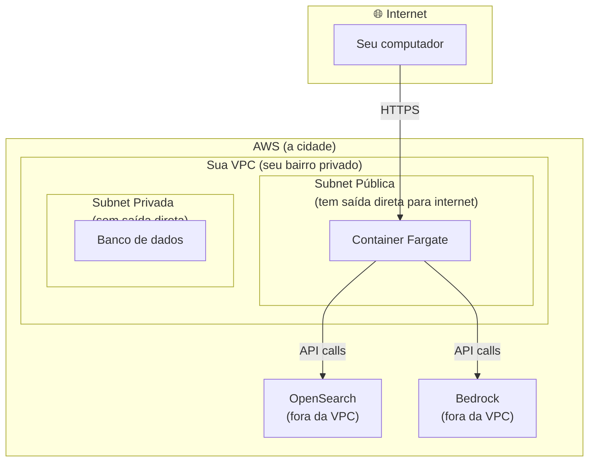
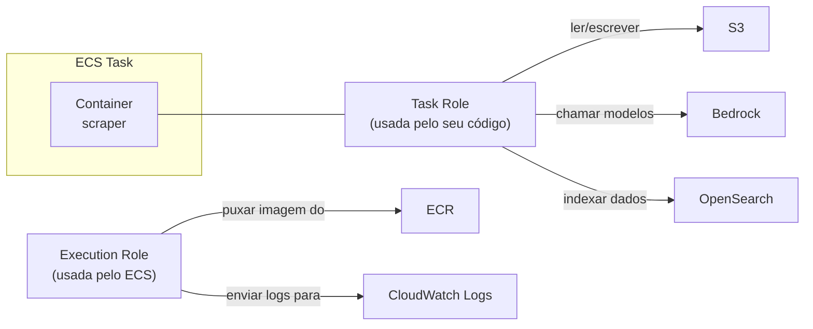
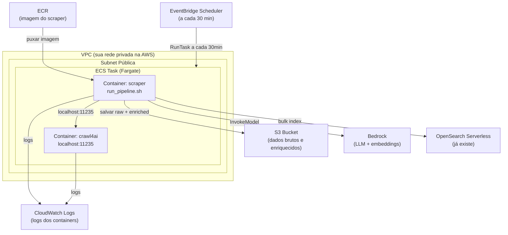
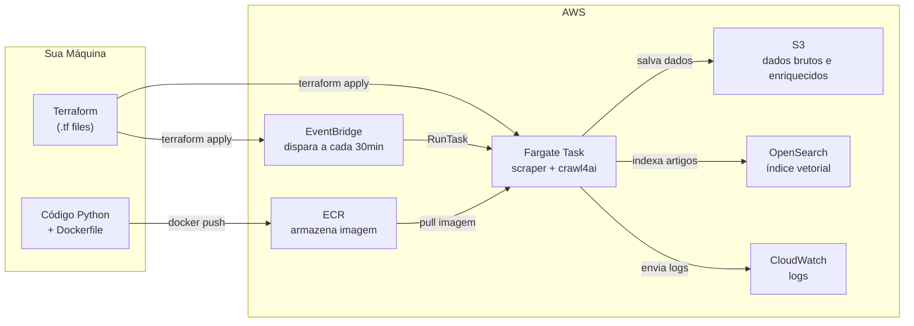

Você tem uma aplicação Python que funciona na sua máquina. Ela coleta notícias, enriquece os artigos com um LLM via Bedrock, e indexa tudo no OpenSearch. Funciona perfeitamente quando você roda manualmente — mas precisa rodar automaticamente, na nuvem, a cada 30 minutos, mesmo quando você está dormindo.

*Como faz isso?*

Este guia vai te levar do zero até um **job agendado rodando no AWS Fargate**, passando por cada problema real que você vai encontrar no caminho. Vamos dockerizar a aplicação, entender o que é VPC (sem enrolar), subir a imagem para o ECR, criar a infraestrutura com Terraform, e configurar o EventBridge Scheduler para disparar tudo automaticamente.

A aplicação real que usamos como exemplo é um scraper de notícias de IA: coleta artigos do Google News, enriquece com Claude via Bedrock (usando um sidecar do Crawl4AI para extrair conteúdo das páginas), e indexa no OpenSearch.

**Metodologia:** cada seção começa com um problema concreto e termina com ele resolvido. Vamos do mais simples para o mais complexo — se algo não funcionar no seu ambiente, você saberá exatamente onde está o problema.

---

## O Ponto de Partida

A aplicação tem uma CLI clara:

```bash
# 1. Coleta artigos do Google News
scraper run --connector google_news

# 2. Enriquece com LLM (topic, description, abstract, tags)
scraper enrich run data/raw/google_news/2026-04-22/batch_123456.jsonl.gz

# 3. Indexa no OpenSearch (só o batch específico, não o diretório inteiro)
scraper ingest run --data-dir data/enriched/google_news/2026-04-22 --file batch_123456.jsonl.gz
```

Funciona localmente. O objetivo: fazer esses três comandos rodarem automaticamente na AWS, num container, a cada 30 minutos.

---

## Parte 1: Docker — Empacotando a Aplicação

### Problema 1: "Funciona aqui, mas como garanto que funciona em qualquer lugar?"

O ambiente local tem Python 3.12, `uv`, as dependências instaladas. Um servidor AWS não tem nada disso. Cada máquina é diferente.

**Solução: Docker.** Você cria uma imagem que contém tudo — o Python certo, as dependências certas, o código — e essa imagem roda igual em qualquer lugar.

A analogia útil: antes de existir o container de carga padronizado, cada tipo de mercadoria exigia um método diferente de transporte. Container padronizou tudo. Docker fez o mesmo com software.

**Conceitos mínimos que você precisa agora:**

| Conceito | O que é |
|----------|---------|
| **Imagem** | Um "pacote" com tudo que a app precisa. Read-only. |
| **Container** | Uma instância em execução de uma imagem. Como um processo isolado. |
| **Dockerfile** | A receita para construir uma imagem. |
| **Registry** | Onde imagens ficam armazenadas (tipo um GitHub para imagens). |

### Seu Primeiro Dockerfile (versão simples)

Antes de criar o Dockerfile, gere o lockfile do `uv` — ele é o equivalente ao `package-lock.json` do npm: garante que a instalação seja 100% idêntica em qualquer máquina ou build:

```bash
# No diretório do scraper
uv lock
```

Isso cria um arquivo `uv.lock`. Commite ele junto com o código.

Agora crie o `Dockerfile` na raiz do projeto do scraper:

```dockerfile
FROM ghcr.io/astral-sh/uv:latest AS uv-bin

FROM python:3.12-slim

COPY --from=uv-bin /uv /usr/local/bin/uv

WORKDIR /app

# Passo 1: instala só as dependências (camada cacheada)
COPY pyproject.toml uv.lock ./
RUN uv sync --frozen --no-dev --no-install-project

# Passo 2: copia o código e instala o projeto (cria o entry point "scraper")
COPY scraper/ scraper/
RUN uv sync --frozen --no-dev

ENV PATH="/app/.venv/bin:$PATH"

CMD ["scraper", "--help"]
```

Linha por linha:

| Instrução | O que faz |
|-----------|-----------|
| `FROM ghcr.io/astral-sh/uv:latest AS uv-bin` | Baixa a imagem oficial do `uv` (só para copiar o binário) |
| `FROM python:3.12-slim` | Imagem base real — Python oficial, versão enxuta (~150MB) |
| `COPY --from=uv-bin /uv /usr/local/bin/uv` | Copia só o binário do `uv` para dentro da imagem Python |
| `WORKDIR /app` | Cria e entra no diretório `/app` dentro do container |
| `COPY pyproject.toml uv.lock ./` | Copia o manifesto e o lockfile de dependências |
| `RUN uv sync --frozen --no-dev --no-install-project` | Instala **só** as dependências do `uv.lock` (sem tentar instalar o projeto em si) |
| `COPY scraper/ scraper/` | Copia o código da aplicação |
| `RUN uv sync --frozen --no-dev` | Agora instala o projeto — cria o entry point `scraper` no venv |
| `ENV PATH="/app/.venv/bin:$PATH"` | Adiciona o venv ao PATH — `scraper` vira um comando disponível |
| `CMD ["scraper", "--help"]` | Comando padrão quando o container iniciar (só para testar) |

> **Por que dois `uv sync`?** O `pyproject.toml` declara um entry point (`scraper = "scraper.main:cli"`). Para criá-lo, o `uv sync` precisa do código-fonte. Mas queremos cachear a instalação das dependências — que são pesadas e mudam pouco. A separação em dois passos resolve: o primeiro (`--no-install-project`) instala só as dependências (camada cacheada), o segundo instala o projeto após o código estar disponível.

> **Por que multi-stage build?** O primeiro `FROM` baixa a imagem do `uv` só para extrair o binário. O segundo `FROM` é a imagem que vai para produção — mais enxuta, sem ferramentas de build desnecessárias. O `COPY --from=uv-bin` copia apenas o binário `/uv` entre as stages.

Construa e teste:

```bash
# Dentro do diretório do scraper
docker build -t scraper:hello .

# Verifica que a CLI funciona
docker run --rm scraper:hello
```

Se aparecer o help do `scraper`, a imagem está funcional. Se der erro, provavelmente é um arquivo faltando no `COPY` — veja a seção de debugging abaixo.

---

### Problema 2: "O build está copiando coisas desnecessárias e é lento"

Por padrão, o `docker build` copia **tudo** do diretório atual para o contexto de build. Isso inclui `.venv` (centenas de MB), `data/` (GBs de artigos), `.git/`, e outros arquivos que não têm nada a ver com a imagem.

Resultado: build lento, imagem grande, e às vezes dados sensíveis dentro da imagem sem querer.

**Solução: `.dockerignore`**

Crie um arquivo `.dockerignore` na raiz do projeto:

```
# Ambiente virtual — recriamos dentro do container
.venv/

# Dados locais — não entram na imagem
data/
logs/

# Git
.git/
.gitignore

# Variáveis de ambiente — NUNCA entram na imagem
.env
*.env

# Cache Python
__pycache__/
*.pyc
*.pyo
*.pyd

# Build artifacts
dist/
build/
*.egg-info/

# Terraform (se estiver na raiz)
.terraform/
*.tfstate
```

Reconstrua e compare:

```bash
docker build -t scraper:hello .
docker images scraper
```

Você vai notar que o build ficou mais rápido e a imagem menor.

---

### Problema 3: "Toda vez que mudo o código, o build reinstala tudo do zero"

Docker usa um sistema de **camadas em cache**. Cada linha do Dockerfile é uma camada. Se uma camada muda, todas as seguintes são reconstruídas.

O problema: se você copiar o código antes de instalar as dependências, qualquer mudança no código invalida o cache das dependências — e o `uv pip install` roda de novo, mesmo que o `pyproject.toml` não tenha mudado.

**Solução: copiar dependências primeiro, código depois.**

O Dockerfile da seção anterior já está nessa ordem correta: `pyproject.toml` e `uv.lock` chegam antes do `COPY scraper/`. Mas vale entender por quê isso importa.

```dockerfile
FROM ghcr.io/astral-sh/uv:latest AS uv-bin

FROM python:3.12-slim

COPY --from=uv-bin /uv /usr/local/bin/uv

WORKDIR /app

# Dependências PRIMEIRO — essa camada fica em cache enquanto o uv.lock não mudar
COPY pyproject.toml uv.lock ./
RUN uv sync --frozen --no-dev --no-install-project

# Código por ÚLTIMO — muda frequentemente, mas não invalida o cache acima
COPY scraper/ scraper/
RUN uv sync --frozen --no-dev

ENV PATH="/app/.venv/bin:$PATH"

CMD ["scraper", "--help"]
```

Agora edite qualquer arquivo em `scraper/` e reconstrua:

```bash
docker build -t scraper:hello .
```

O primeiro `uv sync` (dependências) não vai rodar de novo — vai usar o cache. Só o segundo (instalar o projeto) roda, e é instantâneo. O build do dia a dia fica muito mais rápido.

---

### Problema 4: "Preciso que o container leia variáveis de ambiente sem colocar segredos na imagem"

A aplicação precisa de `OPENSEARCH_HOST`, `AWS_REGION`, `AWS_S3_BUCKET`, e outras variáveis. Elas **não podem** estar dentro da imagem — imagens ficam em registries, podem ser inspecionadas, e segredos lá dentro viram problemas de segurança.

**Solução: variáveis de ambiente em runtime, não no build.**

Docker aceita variáveis de ambiente no `docker run`:

```bash
docker run --rm \
  -e AWS_REGION=us-east-1 \
  -e OPENSEARCH_HOST=meu-endpoint.us-east-1.aoss.amazonaws.com \
  -e INDEX_NAME=newsletter-articles \
  -e AWS_S3_BUCKET=meu-bucket \
  scraper:hello \
  scraper run --connector google_news --local
```

Para testar localmente sem repetir as variáveis toda hora, você pode usar um arquivo `.env` **junto com `--env-file`**:

```bash
# .env (nunca commitar este arquivo)
AWS_REGION=us-east-1
OPENSEARCH_HOST=meu-endpoint.us-east-1.aoss.amazonaws.com
INDEX_NAME=newsletter-articles
AWS_S3_BUCKET=meu-bucket
```

```bash
docker run --rm --env-file .env scraper:hello scraper run --connector google_news --local
```

> **Importante:** `--env-file` é diferente de copiar o `.env` para dentro da imagem com `COPY`. Com `--env-file`, os valores são injetados apenas quando o container roda — a imagem em si não contém nenhum segredo.

---

### Problema 5: "O enricher precisa do Crawl4AI rodando em `localhost:11235` — como rodo dois containers juntos?"

O enricher usa o Crawl4AI para extrair conteúdo das páginas web antes de passar para o LLM. Ele espera encontrar o Crawl4AI em `http://localhost:11235`. Esse é um serviço separado, rodando em outro container.

Para desenvolvimento local, o **Docker Compose** resolve isso: define múltiplos containers que rodam juntos, compartilhando rede.

**Solução: `docker-compose.yml` para desenvolvimento local**

Crie `docker-compose.yml` na raiz do projeto do scraper:

```yaml
services:
  crawl4ai:
    image: unclecode/crawl4ai:latest
    ports:
      - "11235:11235"
    healthcheck:
      test: ["CMD", "curl", "-f", "http://localhost:11235/health"]
      interval: 10s
      timeout: 5s
      retries: 5

  scraper:
    build: .
    network_mode: "service:crawl4ai"
    depends_on:
      crawl4ai:
        condition: service_healthy
    env_file: .env
    volumes:
      - ./data:/app/data
```

O ENTRYPOINT do Dockerfile (`scripts/run_pipeline.sh`, que criaremos no próximo problema) será o comando executado. Suba tudo com:

```bash
docker compose up
```

O Compose garante que o `crawl4ai` esteja saudável antes de iniciar o `scraper`.

> **Por que `network_mode: "service:crawl4ai"`?** O código do enricher está hardcodado para chamar `http://localhost:11235`. No Compose normal, cada serviço tem rede separada — `localhost` do scraper aponta para ele mesmo, não para o crawl4ai. O `network_mode: "service:crawl4ai"` faz o scraper **compartilhar a rede** do crawl4ai, exatamente como vai ser no Fargate. Assim `localhost:11235` funciona.

---

### Problema 6: "E se o Crawl4AI não estiver pronto quando o scraper começar?"

No Compose, usamos `depends_on` com `condition: service_healthy`. No Fargate, o ECS tem `dependsOn` com `condition: START` — mas isso só garante que o container **iniciou**, não que ele está pronto para receber requisições.

O Crawl4AI precisa baixar e inicializar um browser Chromium, o que pode levar de 10 a 60 segundos. Se o scraper tentar chamá-lo antes, vai falhar.

**Solução: um script de entrada que espera o Crawl4AI ficar disponível antes de começar.**

**Crie `scripts/run_pipeline.sh`:**

```bash
#!/usr/bin/env bash
#
# Google News pipeline para Fargate: scrape → enrich → ingest
# Baseado em scripts/google_news_pipeline.sh (versão local/cron)
#
set -euo pipefail

log() { echo "[$(date '+%H:%M:%S')] $*"; }

# ── Espera o Crawl4AI estar disponível ──
log "=== Aguardando Crawl4AI em localhost:11235 ==="

python3 - <<'PY'
import socket, time, sys

for attempt in range(60):
    try:
        s = socket.socket()
        s.settimeout(2)
        s.connect(("127.0.0.1", 11235))
        s.close()
        print(f"  Crawl4AI disponível após {attempt * 2}s")
        sys.exit(0)
    except Exception:
        time.sleep(2)

print("ERRO: Crawl4AI não ficou disponível em 120s", file=sys.stderr)
sys.exit(1)
PY

# ── 1. Scrape ──
log "=== Scrape ==="
OUTPUT=$(scraper run --connector google_news 2>&1 | tee /dev/stderr)

# Extrai o caminho do batch file do output do scraper
BATCH_FILE=$(echo "$OUTPUT" | grep -o 'data/raw/google_news/[^ ]*\.jsonl[^ ]*' | head -1)

if [ -z "${BATCH_FILE:-}" ]; then
    log "Nenhum batch produzido. Saindo."
    exit 0
fi
log "Batch: $BATCH_FILE"

# ── 2. Enrich ──
log "=== Enrich ==="
scraper enrich run "$BATCH_FILE"

# ── 3. Ingest (só o batch que acabou de enriquecer, não o diretório inteiro) ──
BATCH_NAME=$(basename "$BATCH_FILE")
ENRICHED_DIR="data/enriched/google_news/$(date -u +%Y-%m-%d)"
ENRICHED_FILE="$ENRICHED_DIR/$BATCH_NAME"

if [ -f "$ENRICHED_FILE" ]; then
    log "=== Ingest ==="
    log "Ingerindo: $ENRICHED_FILE"
    scraper ingest run --data-dir "$ENRICHED_DIR" --file "$BATCH_NAME"
else
    log "Arquivo enriquecido não encontrado em $ENRICHED_FILE, pulando ingest."
fi

log "=== Pipeline concluído ==="
```

Torne o script executável:

```bash
chmod +x scripts/run_pipeline.sh
```

Agora atualize o `Dockerfile` para usar esse script como entrypoint:

```dockerfile
FROM ghcr.io/astral-sh/uv:latest AS uv-bin

FROM python:3.12-slim

COPY --from=uv-bin /uv /usr/local/bin/uv

WORKDIR /app

COPY pyproject.toml uv.lock ./
RUN uv sync --frozen --no-dev --no-install-project

COPY scraper/ scraper/
RUN uv sync --frozen --no-dev

ENV PATH="/app/.venv/bin:$PATH"

COPY scripts/run_pipeline.sh scripts/run_pipeline.sh
RUN chmod +x scripts/run_pipeline.sh

ENTRYPOINT ["scripts/run_pipeline.sh"]
```

Teste localmente com o Compose:

```bash
docker compose up --build
```

Se tudo correr bem, você vai ver os quatro passos no log: aguardando Crawl4AI, coletando, enriquecendo, indexando.

---

## Parte 2: VPC e Rede — Entendendo o Terreno

Antes de subir qualquer coisa para a AWS, precisamos entender onde os containers vão rodar. E isso passa por entender VPC.

### O Que É VPC (versão ELI5)

Imagine que a AWS é uma cidade enorme. Milhares de empresas têm servidores nessa cidade. Se todos os servidores estivessem na mesma rede pública, qualquer pessoa poderia tentar acessar qualquer servidor.

**VPC (Virtual Private Cloud)** é como ter um bairro privado dentro dessa cidade. Você cria a sua rede isolada, e só o que você autorizar consegue entrar ou sair.



**Subnets** são subdivisões da VPC — como quarteirões dentro do bairro. Existem dois tipos:

- **Subnet pública**: tem uma rota direta para a internet. Containers aqui podem receber e fazer requisições externas diretamente.
- **Subnet privada**: sem rota direta para a internet. Para sair, precisa de um NAT Gateway (um "porteiro" que faz as requisições em seu nome).

**Por que isso importa para o nosso caso?**

O scraper precisa:
1. Fazer requisições para a internet (buscar artigos do Google News)
2. Chamar Bedrock (serviço AWS)
3. Escrever no OpenSearch Serverless (serviço AWS)
4. Escrever no S3 (serviço AWS)

Para isso, o container precisa ter acesso à internet — seja por subnet pública (mais simples, adequado para um PoC) ou subnet privada com NAT Gateway (mais seguro, mais caro).

**Para começar: usaremos subnet pública com IP público atribuído.** É o caminho mais simples e direto para um primeiro deploy funcional.

### Como Descobrir a VPC e Subnets da Sua Conta

A AWS cria uma **VPC default** em cada região quando você cria a conta. É a mais simples de usar para começar. Para encontrá-la:

```bash
# Descobre a VPC default
aws ec2 describe-vpcs \
  --filters "Name=isDefault,Values=true" \
  --profile homegenius-admin \
  --region us-east-1 \
  --query "Vpcs[0].VpcId" \
  --output text
# Resultado: vpc-xxxxxxxxxx

# Descobre as subnets dessa VPC
aws ec2 describe-subnets \
  --filters "Name=vpc-id,Values=<VPC_ID_ACIMA>" \
  --profile homegenius-admin \
  --region us-east-1 \
  --query "Subnets[*].[SubnetId,AvailabilityZone,MapPublicIpOnLaunch]" \
  --output table
```

Anote o `vpc-id` e pelo menos dois `subnet-id` que tenham `MapPublicIpOnLaunch = True` (subnets públicas). Vamos precisar deles no `terraform.tfvars`.

### Security Groups: O "Firewall" do Container

Dentro da VPC, o **Security Group** é o firewall que controla o que entra e sai de cada recurso. Para o nosso scraper:

- **Entrada (ingress):** nenhuma — o container não recebe conexões de fora
- **Saída (egress):** tudo liberado — o container precisa chamar a internet, Bedrock, OpenSearch, S3

O Terraform vai criar isso automaticamente. Só estou explicando para você entender o que está sendo criado.

---

## Parte 3: ECR e S3 — Onde Ficam a Imagem e os Dados

**ECR (Elastic Container Registry)** é o "GitHub para imagens Docker" da AWS. Em vez de usar o Docker Hub público, você usa o ECR que fica dentro da sua conta — mais seguro e integrado com o IAM.

O fluxo do ECR é:
1. Criar o repositório ECR (uma vez)
2. Buildar a imagem localmente
3. Autenticar o Docker no ECR
4. Dar push da imagem
5. O Fargate puxará essa imagem quando executar a task

Vamos criar o ECR junto com o restante da infra no Terraform (Parte 5). Mas antes, vamos testar o S3.

### Testando o S3 Antes de Tudo

Antes de partir para a infra completa, vamos testar se o S3 está funcionando corretamente com a aplicação. O scraper salva os dados brutos no S3 quando `AWS_S3_BUCKET` está configurado.

> **Nota:** aqui vamos criar um bucket de teste pela CLI. Quando rodarmos o Terraform na Parte 7, ele vai criar o bucket definitivo — com versionamento, criptografia e bloqueio de acesso público. O bucket de teste pode ser removido depois com `aws s3 rb s3://NOME --force`.

**Passo 1: Crie um bucket de teste pelo CLI**

```bash
# Escolha um nome único (buckets S3 são globais na AWS)
BUCKET_NAME="newsletter-scraper-test-$(aws sts get-caller-identity \
  --profile homegenius-admin \
  --query Account \
  --output text)"

echo "Nome do bucket: ${BUCKET_NAME}"

aws s3 mb "s3://${BUCKET_NAME}" \
  --region us-east-1 \
  --profile homegenius-admin
```

**Passo 2: Teste o upload manualmente**

```bash
# Cria um arquivo de teste
echo '{"test": "hello s3"}' > /tmp/test.jsonl

# Faz upload
aws s3 cp /tmp/test.jsonl "s3://${BUCKET_NAME}/test/hello.jsonl" \
  --profile homegenius-admin

# Confirma que chegou
aws s3 ls "s3://${BUCKET_NAME}/test/" \
  --profile homegenius-admin
```

**Passo 3: Rode o scraper localmente apontando para o S3**

```bash
# Adiciona ao .env
echo "AWS_S3_BUCKET=${BUCKET_NAME}" >> .env

# Roda (sem --local, para ir ao S3)
source .venv/bin/activate
scraper run --connector google_news

# Verifica se chegou no S3
aws s3 ls "s3://${BUCKET_NAME}/raw/google_news/" \
  --profile homegenius-admin \
  --recursive
```

Se aparecerem arquivos `.jsonl.gz` no S3, o pipeline de output está funcionando.

**Passo 4: Limpe o bucket de teste (quando não precisar mais)**

```bash
aws s3 rb "s3://${BUCKET_NAME}" --force --profile homegenius-admin
```

---

## Parte 4: IAM — Permissões na AWS

### O Conceito Mais Importante de IAM

Na AWS, por padrão, **nada tem permissão para fazer nada**. Cada serviço, container, ou recurso precisa de permissão explícita para acessar outros serviços.

Para o nosso scraper, vamos ter dois tipos de role:



**Execution Role** = a AWS precisa disso para *iniciar* o container (puxar imagem, mandar logs)

**Task Role** = seu código precisa disso para *rodar* (acessar S3, Bedrock, OpenSearch)

São duas roles diferentes com propósitos diferentes. Confundir as duas é um dos erros mais comuns.

### OpenSearch Serverless: a Camada Extra de IAM

O OpenSearch Serverless tem uma camada de autorização além do IAM: a **Data Access Policy**. Mesmo que a Task Role tenha `aoss:APIAccessAll`, você também precisa adicionar o ARN da role na data access policy da collection.

Seu colega Pedro já fez isso para o EC2. Para o Fargate, você vai precisar repetir o processo com a nova task role — mas isso vem depois, quando o Terraform criar a role e você tiver o ARN.

---

## Parte 5: Terraform — Infraestrutura como Código

### Por Que Terraform e Não o Console da AWS?

Você poderia criar tudo pelo console da AWS clicando em botões. Funciona, mas tem problemas:

- Difícil de reproduzir (e se precisar criar em outra região?)
- Difícil de auditar (quem criou o quê quando?)
- Impossível de versionar no git
- Se algo der errado, você não sabe o estado exato de antes

Terraform resolve tudo isso: você escreve o que quer que exista, e o Terraform cria, atualiza ou destroi recursos para chegar naquele estado.

**O ciclo básico:**

```bash
terraform init    # Baixa os plugins necessários (só na primeira vez)
terraform plan    # "O que eu vou criar/alterar/destruir?"
terraform apply   # Executa o plano
terraform destroy # Destroi tudo (use com cuidado!)
```

O `terraform plan` é seu melhor amigo — sempre rode antes do `apply` e leia o que vai ser criado.

### Estrutura de Arquivos

Crie o diretório de infra do scraper:

```
newsletter-application/
├── infra/              ← infra do EC2/backend/frontend (já existe, não mexe)
└── scraper/
    ├── infra/          ← infra nova do Fargate (vamos criar aqui)
    │   ├── main.tf
    │   ├── variables.tf
    │   ├── iam.tf
    │   ├── ecr.tf
    │   ├── s3.tf
    │   ├── ecs.tf
    │   ├── scheduler.tf
    │   ├── outputs.tf
    │   └── terraform.tfvars
    ├── scraper/
    ├── scripts/
    ├── Dockerfile
    └── pyproject.toml
```

> **Por que `scraper/infra/` e não junto com o `infra/` existente?** Isolamento. Se algo der errado aqui, não afeta o backend e o frontend que já estão em produção. Terraform mantém um **state** separado para cada diretório — são infraestruturas independentes.

### O Que o Terraform Vai Criar

Antes de ver o código, entenda a arquitetura completa:



**Recursos que o Terraform vai criar:**

| Recurso | Para quê |
|---------|---------|
| `aws_ecr_repository` | Armazenar a imagem do scraper |
| `aws_s3_bucket` | Armazenar dados brutos e enriquecidos |
| `aws_cloudwatch_log_group` | Centralizar logs dos containers |
| `aws_ecs_cluster` | Agrupamento lógico das tasks |
| `aws_ecs_task_definition` | O "molde" dos containers (2 containers: scraper + crawl4ai) |
| `aws_iam_role` (3x) | Execution role, task role, scheduler role |
| `aws_security_group` | Firewall do container |
| `aws_scheduler_schedule` | Disparo a cada 30 minutos |

---

### Os Arquivos Terraform

**`main.tf`**

```hcl
terraform {
  required_version = ">= 1.5"

  required_providers {
    aws = {
      source  = "hashicorp/aws"
      version = "~> 5.90"
    }
  }
}

provider "aws" {
  region  = var.aws_region
  profile = var.aws_profile

  default_tags {
    tags = {
      Project = "newsletter-scraper"
    }
  }
}

data "aws_caller_identity" "current" {}
```

---

**`variables.tf`**

```hcl
variable "aws_region" {
  type    = string
  default = "us-east-1"
}

variable "aws_profile" {
  type    = string
  default = "homegenius-admin"
}

variable "project_name" {
  type    = string
  default = "newsletter-scraper"
}

variable "image_tag" {
  type    = string
  default = "latest"
}

variable "crawl4ai_image" {
  type    = string
  default = "unclecode/crawl4ai:latest"
}

variable "schedule_expression" {
  type    = string
  default = "rate(30 minutes)"
}

variable "vpc_id" {
  type        = string
  description = "ID da VPC onde o container vai rodar (ex: vpc-xxxxxxxxxx)"
}

variable "subnet_ids" {
  type        = list(string)
  description = "IDs das subnets públicas (ex: [\"subnet-aaa\", \"subnet-bbb\"])"
}

variable "opensearch_host" {
  type        = string
  description = "Host do OpenSearch Serverless (sem https://)"
}

variable "opensearch_collection_arn" {
  type        = string
  description = "ARN da collection do OpenSearch Serverless"
}

variable "index_name" {
  type    = string
  default = "newsletter-articles"
}

variable "embedding_model_id" {
  type    = string
  default = "amazon.titan-embed-text-v2:0"
}

variable "bedrock_model_id" {
  type    = string
  default = "us.anthropic.claude-haiku-4-5-20251001-v1:0"
}

variable "tavily_secret_arn" {
  type        = string
  default     = ""
  description = "ARN do secret do Tavily API key no Secrets Manager (opcional)"
}
```

---

**`ecr.tf`**

```hcl
resource "aws_ecr_repository" "scraper" {
  name                 = "newsletter/scraper"
  image_tag_mutability = "MUTABLE"
  force_delete         = true

  image_scanning_configuration {
    scan_on_push = true
  }
}
```

---

**`s3.tf`**

```hcl
resource "aws_s3_bucket" "artifacts" {
  bucket = "${var.project_name}-${data.aws_caller_identity.current.account_id}-${var.aws_region}"
}

resource "aws_s3_bucket_versioning" "artifacts" {
  bucket = aws_s3_bucket.artifacts.id

  versioning_configuration {
    status = "Enabled"
  }
}

resource "aws_s3_bucket_server_side_encryption_configuration" "artifacts" {
  bucket = aws_s3_bucket.artifacts.id

  rule {
    apply_server_side_encryption_by_default {
      sse_algorithm = "AES256"
    }
  }
}

resource "aws_s3_bucket_public_access_block" "artifacts" {
  bucket = aws_s3_bucket.artifacts.id

  block_public_acls       = true
  block_public_policy     = true
  ignore_public_acls      = true
  restrict_public_buckets = true
}
```

> O nome do bucket usa o Account ID para garantir unicidade global (nomes de bucket S3 são únicos em toda a AWS, não só na sua conta).

---

**`iam.tf`**

```hcl
# ──────────────────────────────────────────────
# Execution Role — usada pelo ECS para iniciar o container
# ──────────────────────────────────────────────
resource "aws_iam_role" "ecs_execution" {
  name = "${var.project_name}-execution-role"

  assume_role_policy = jsonencode({
    Version = "2012-10-17"
    Statement = [{
      Action    = "sts:AssumeRole"
      Effect    = "Allow"
      Principal = { Service = "ecs-tasks.amazonaws.com" }
    }]
  })
}

resource "aws_iam_role_policy_attachment" "ecs_execution_managed" {
  role       = aws_iam_role.ecs_execution.name
  policy_arn = "arn:aws:iam::aws:policy/service-role/AmazonECSTaskExecutionRolePolicy"
}

# Permissão extra para ler secrets do Secrets Manager (Tavily key)
resource "aws_iam_role_policy" "ecs_execution_secrets" {
  count = var.tavily_secret_arn != "" ? 1 : 0

  name = "${var.project_name}-execution-secrets"
  role = aws_iam_role.ecs_execution.id

  policy = jsonencode({
    Version = "2012-10-17"
    Statement = [{
      Effect   = "Allow"
      Action   = ["secretsmanager:GetSecretValue"]
      Resource = [var.tavily_secret_arn]
    }]
  })
}

# ──────────────────────────────────────────────
# Task Role — usada pelo código dentro do container
# ──────────────────────────────────────────────
resource "aws_iam_role" "ecs_task" {
  name = "${var.project_name}-task-role"

  assume_role_policy = jsonencode({
    Version = "2012-10-17"
    Statement = [{
      Action    = "sts:AssumeRole"
      Effect    = "Allow"
      Principal = { Service = "ecs-tasks.amazonaws.com" }
    }]
  })
}

resource "aws_iam_role_policy" "ecs_task_s3" {
  name = "${var.project_name}-task-s3"
  role = aws_iam_role.ecs_task.id

  policy = jsonencode({
    Version = "2012-10-17"
    Statement = [{
      Effect = "Allow"
      Action = ["s3:PutObject", "s3:GetObject", "s3:ListBucket"]
      Resource = [
        aws_s3_bucket.artifacts.arn,
        "${aws_s3_bucket.artifacts.arn}/*"
      ]
    }]
  })
}

resource "aws_iam_role_policy" "ecs_task_bedrock" {
  name = "${var.project_name}-task-bedrock"
  role = aws_iam_role.ecs_task.id

  policy = jsonencode({
    Version = "2012-10-17"
    Statement = [{
      Effect   = "Allow"
      Action   = ["bedrock:InvokeModel", "bedrock:InvokeModelWithResponseStream"]
      Resource = ["*"]
    }]
  })
}

resource "aws_iam_role_policy" "ecs_task_opensearch" {
  name = "${var.project_name}-task-opensearch"
  role = aws_iam_role.ecs_task.id

  policy = jsonencode({
    Version = "2012-10-17"
    Statement = [{
      Effect   = "Allow"
      Action   = ["aoss:APIAccessAll"]
      Resource = [var.opensearch_collection_arn]
    }]
  })
}

# ──────────────────────────────────────────────
# Scheduler Role — usada pelo EventBridge para chamar o ECS
# ──────────────────────────────────────────────
resource "aws_iam_role" "scheduler" {
  name = "${var.project_name}-scheduler-role"

  assume_role_policy = jsonencode({
    Version = "2012-10-17"
    Statement = [{
      Action    = "sts:AssumeRole"
      Effect    = "Allow"
      Principal = { Service = "scheduler.amazonaws.com" }
    }]
  })
}

resource "aws_iam_role_policy" "scheduler_run_task" {
  name = "${var.project_name}-scheduler-run-task"
  role = aws_iam_role.scheduler.id

  policy = jsonencode({
    Version = "2012-10-17"
    Statement = [
      {
        Effect   = "Allow"
        Action   = ["ecs:RunTask"]
        Resource = ["${aws_ecs_task_definition.scraper.arn_without_revision}:*"]
      },
      {
        Effect = "Allow"
        Action = ["iam:PassRole"]
        Resource = [
          aws_iam_role.ecs_execution.arn,
          aws_iam_role.ecs_task.arn
        ]
      }
    ]
  })
}
```

> **Por que o Scheduler precisa de `iam:PassRole`?** Quando o EventBridge chama o ECS para criar uma task, ele precisa "passar" as duas roles (execution + task) para o ECS. Sem esse `PassRole`, o ECS recusa por não confiar que o Scheduler tem direito a usar essas roles.
>
> **Por que `arn_without_revision:*` no `ecs:RunTask`?** Toda vez que você altera a task definition (mudar CPU, adicionar variável de ambiente, etc), o Terraform cria uma **nova revisão** (ex: `newsletter-scraper:2`). Se a policy apontasse para o ARN com revisão fixa (`:1`), o Scheduler perderia permissão após qualquer update. O wildcard `:*` permite qualquer revisão.

---

**`ecs.tf`**

```hcl
resource "aws_cloudwatch_log_group" "scraper" {
  name              = "/ecs/${var.project_name}"
  retention_in_days = 14
}

resource "aws_ecs_cluster" "scraper" {
  name = "${var.project_name}-cluster"
}

resource "aws_security_group" "scraper_task" {
  name        = "${var.project_name}-task-sg"
  description = "Scraper ECS task — saída para internet liberada, sem entrada"
  vpc_id      = var.vpc_id

  egress {
    description = "Saída total para internet (Bedrock, OpenSearch, Google News)"
    from_port   = 0
    to_port     = 0
    protocol    = "-1"
    cidr_blocks = ["0.0.0.0/0"]
  }
}

locals {
  scraper_image_uri = "${aws_ecr_repository.scraper.repository_url}:${var.image_tag}"

  # Variáveis de ambiente para o container do scraper
  scraper_env = [
    { name = "AWS_REGION",          value = var.aws_region },
    { name = "OPENSEARCH_HOST",     value = var.opensearch_host },
    { name = "INDEX_NAME",          value = var.index_name },
    { name = "EMBEDDING_MODEL_ID",  value = var.embedding_model_id },
    { name = "BEDROCK_MODEL_ID",    value = var.bedrock_model_id },
    { name = "AWS_S3_BUCKET",       value = aws_s3_bucket.artifacts.bucket },
  ]

  # Se o secret do Tavily foi configurado, adiciona via secretsFrom
  tavily_secrets = var.tavily_secret_arn != "" ? [
    {
      name      = "TAVILY_API_KEY"
      valueFrom = var.tavily_secret_arn
    }
  ] : []

  container_definitions = jsonencode([
    {
      name      = "crawl4ai"
      image     = var.crawl4ai_image
      essential = true

      portMappings = [{
        containerPort = 11235
        hostPort      = 11235
        protocol      = "tcp"
      }]

      logConfiguration = {
        logDriver = "awslogs"
        options = {
          "awslogs-group"         = aws_cloudwatch_log_group.scraper.name
          "awslogs-region"        = var.aws_region
          "awslogs-stream-prefix" = "crawl4ai"
        }
      }
    },
    {
      name      = "scraper"
      image     = local.scraper_image_uri
      essential = true

      dependsOn = [{
        containerName = "crawl4ai"
        condition     = "START"
      }]

      environment = local.scraper_env
      secrets     = local.tavily_secrets

      logConfiguration = {
        logDriver = "awslogs"
        options = {
          "awslogs-group"         = aws_cloudwatch_log_group.scraper.name
          "awslogs-region"        = var.aws_region
          "awslogs-stream-prefix" = "scraper"
        }
      }
    }
  ])
}

resource "aws_ecs_task_definition" "scraper" {
  family                   = var.project_name
  requires_compatibilities = ["FARGATE"]
  network_mode             = "awsvpc"
  cpu                      = "2048"
  memory                   = "4096"
  execution_role_arn       = aws_iam_role.ecs_execution.arn
  task_role_arn            = aws_iam_role.ecs_task.arn
  container_definitions    = local.container_definitions

  runtime_platform {
    operating_system_family = "LINUX"
    cpu_architecture        = "X86_64"
  }
}
```

> **Por que 2 vCPU e 4GB?** O Crawl4AI usa um browser headless (Chromium), que é pesado. 1 vCPU e 2GB é suficiente apenas para apps mais leves. Depois que você ver os logs do primeiro run, pode ajustar para baixo se quiser economizar.

> **`condition: "START"` vs `"HEALTHY"`:** `START` significa "o container crawl4ai iniciou". `HEALTHY` exigiria um `healthcheck` configurado na task definition, o que adicionaria complexidade. Por isso usamos `START` aqui e tratamos a espera no script `run_pipeline.sh` — que já tem um loop de 120s verificando `localhost:11235`.

---

**`scheduler.tf`**

```hcl
resource "aws_scheduler_schedule" "scraper" {
  name                         = "${var.project_name}-schedule"
  schedule_expression          = var.schedule_expression
  schedule_expression_timezone = "UTC"
  state                        = "ENABLED"

  flexible_time_window {
    mode = "OFF"
  }

  target {
    arn      = aws_ecs_cluster.scraper.arn
    role_arn = aws_iam_role.scheduler.arn

    ecs_parameters {
      task_definition_arn = aws_ecs_task_definition.scraper.arn
      launch_type         = "FARGATE"
      task_count          = 1
      platform_version    = "LATEST"

      network_configuration {
        subnets          = var.subnet_ids
        security_groups  = [aws_security_group.scraper_task.id]
        assign_public_ip = true
      }
    }

    retry_policy {
      maximum_retry_attempts = 1
    }
  }
}
```

> **`flexible_time_window = "OFF"`:** o job roda exatamente no horário configurado. Se você usasse `FLEXIBLE`, a AWS teria uma janela de até N minutos para executar em qualquer momento. Para um scraper, queremos horário determinístico.

> **`retry_policy.maximum_retry_attempts = 1`:** se a task falhar, o Scheduler tentará uma vez mais. Sem isso, falhas silenciosas podem passar despercebidas.

---

**`outputs.tf`**

```hcl
output "ecr_repository_url" {
  value       = aws_ecr_repository.scraper.repository_url
  description = "URL do repositório ECR — use para o docker push"
}

output "s3_bucket_name" {
  value       = aws_s3_bucket.artifacts.bucket
  description = "Nome do bucket S3 de artefatos"
}

output "ecs_cluster_name" {
  value = aws_ecs_cluster.scraper.name
}

output "task_role_arn" {
  value       = aws_iam_role.ecs_task.arn
  description = "ARN da task role — adicione na data access policy do OpenSearch"
}

output "log_group_name" {
  value       = aws_cloudwatch_log_group.scraper.name
  description = "Nome do log group no CloudWatch"
}
```

---

**`terraform.tfvars`**

```hcl
aws_region   = "us-east-1"
aws_profile  = "homegenius-admin"
project_name = "newsletter-scraper"
image_tag    = "latest"

schedule_expression = "rate(30 minutes)"

# Preencha com o resultado dos comandos aws ec2 describe-vpcs e describe-subnets
vpc_id     = "vpc-xxxxxxxxxx"
subnet_ids = ["subnet-aaaaaaa", "subnet-bbbbbbb"]

# Seu endpoint OpenSearch (sem https://)
opensearch_host           = "xxxxxxxxxxxx.us-east-1.aoss.amazonaws.com"
opensearch_collection_arn = "arn:aws:aoss:us-east-1:123456789012:collection/xxxxxxxxxx"

index_name         = "newsletter-articles"
embedding_model_id = "amazon.titan-embed-text-v2:0"
bedrock_model_id   = "us.anthropic.claude-haiku-4-5-20251001-v1:0"

# Se não tiver Tavily: deixe em branco
tavily_secret_arn = ""
```

---

## Parte 6: Tavily API Key no Secrets Manager (Opcional, mas Correto)

Se você quiser usar a Tavily API Key, não coloque ela em variável de ambiente diretamente — variáveis de ambiente podem aparecer em logs, no console da AWS, e em ferramentas de auditoria.

O lugar correto é o **AWS Secrets Manager**.

**Passo 1: Criar o secret pelo CLI**

```bash
aws secretsmanager create-secret \
  --name "newsletter-scraper/tavily-api-key" \
  --secret-string "tvly-dev-xxxxxxxxxxxx" \
  --region us-east-1 \
  --profile homegenius-admin
```

Anote o ARN retornado. Parece algo como:
```
arn:aws:secretsmanager:us-east-1:123456789012:secret:newsletter-scraper/tavily-api-key-AbCdEf
```

**Passo 2: Adicionar ao `terraform.tfvars`**

```hcl
tavily_secret_arn = "arn:aws:secretsmanager:us-east-1:123456789012:secret:newsletter-scraper/tavily-api-key-AbCdEf"
```

Quando configurado, o Terraform vai:
1. Dar permissão para a Execution Role ler esse secret
2. Injetar o valor como variável de ambiente `TAVILY_API_KEY` no container em runtime

O valor nunca fica na task definition em texto plano — o ECS busca do Secrets Manager na hora de iniciar o container.

---

## Parte 7: Deploy Passo a Passo

Agora que você entende cada peça, aqui está o checklist de deploy na ordem correta.

### Checklist Pré-Deploy

Antes de rodar qualquer Terraform, confirme:

- [ ] `aws sts get-caller-identity --profile homegenius-admin` funciona (credenciais válidas)
- [ ] Você tem o `vpc_id` e pelo menos dois `subnet_ids` em mãos
- [ ] Você tem o `opensearch_host` e `opensearch_collection_arn`
- [ ] O S3 local foi testado (Parte 3)
- [ ] O Docker local foi testado (Parte 1)
- [ ] `terraform.tfvars` está preenchido

### Passo 1: Inicializar o Terraform

```bash
cd scraper/infra

terraform init
```

Isso baixa o provider AWS. Você vai ver algo como:
```
Terraform has been successfully initialized!
```

### Passo 2: Ver o Que Vai Ser Criado

```bash
terraform plan
```

Leia com atenção. Você vai ver algo como:
```
Plan: 14 to add, 0 to change, 0 to destroy.
```

Confirme que não tem nada inesperado — especialmente nenhum `to destroy`.

### Passo 3: Criar ECR e S3 Primeiro

```bash
terraform apply -target=aws_ecr_repository.scraper -target=aws_s3_bucket.artifacts
```

> **Por quê separado?** Porque o próximo passo é fazer push da imagem para o ECR. Se o ECR não existir ainda, o `docker push` vai falhar. Criamos o ECR primeiro, depois fazemos o push, depois aplicamos o resto.

Confirme com `yes` quando solicitado.

### Passo 4: Pegar a URL do ECR

```bash
terraform output ecr_repository_url
# Resultado: 123456789012.dkr.ecr.us-east-1.amazonaws.com/newsletter/scraper
```

### Passo 5: Buildar e Fazer Push da Imagem

```bash
# Salva a URL do ECR em variável
ECR_URL=$(terraform output -raw ecr_repository_url)
ACCOUNT_ID=$(echo $ECR_URL | cut -d. -f1)

# Autentica o Docker no ECR
aws ecr get-login-password \
  --region us-east-1 \
  --profile homegenius-admin \
  | docker login --username AWS --password-stdin "${ACCOUNT_ID}.dkr.ecr.us-east-1.amazonaws.com"

# Builda a imagem (no diretório do scraper, não no infra/)
cd ..
docker build --platform linux/amd64 -t newsletter-scraper:latest .

# Tageia para o ECR
docker tag newsletter-scraper:latest "${ECR_URL}:latest"

# Faz push
docker push "${ECR_URL}:latest"
```

> **`--platform linux/amd64`:** se você estiver num Mac com Apple Silicon (M1/M2/M3/M4), o Docker builda imagens ARM por padrão. O Fargate com `cpu_architecture = "X86_64"` precisa de imagens amd64. Sem essa flag, o container vai falhar com `exec format error` no Fargate.

Confirme que chegou:
```bash
aws ecr list-images \
  --repository-name newsletter/scraper \
  --profile homegenius-admin \
  --region us-east-1
```

### Passo 6: Aplicar o Restante da Infraestrutura

```bash
cd infra
terraform apply
```

Confirme com `yes`. O Terraform vai criar o cluster ECS, roles IAM, security group, task definition e o Scheduler.

### Passo 7: Adicionar a Task Role na Data Access Policy do OpenSearch

Esse passo é obrigatório — sem ele, o container não consegue escrever no OpenSearch.

Primeiro, pegue o ARN da task role:
```bash
terraform output task_role_arn
# Resultado: arn:aws:iam::123456789012:role/newsletter-scraper-task-role
```

Agora adicione esse ARN na data access policy da sua collection OpenSearch Serverless. Peça ao Pedro o script que ele usa — ele já fez isso para o EC2 e tem o processo documentado. O que muda é só o ARN da role.

### Passo 8: Teste Manual — Disparar a Task

Antes de esperar o agendamento, teste manualmente:

```bash
# Descobre as subnets e security group
CLUSTER=$(terraform output -raw ecs_cluster_name)
TASK_DEF=$(terraform output -raw task_definition_arn 2>/dev/null || \
  aws ecs describe-task-definition \
    --task-definition newsletter-scraper \
    --profile homegenius-admin \
    --region us-east-1 \
    --query "taskDefinition.taskDefinitionArn" \
    --output text)

# Roda a task manualmente
aws ecs run-task \
  --cluster "${CLUSTER}" \
  --task-definition newsletter-scraper \
  --launch-type FARGATE \
  --network-configuration "awsvpcConfiguration={subnets=[subnet-aaa,subnet-bbb],securityGroups=[sg-xxxxxxxxx],assignPublicIp=ENABLED}" \
  --profile homegenius-admin \
  --region us-east-1
```

### Passo 9: Acompanhar os Logs

```bash
# Descobre o nome do log group
LOG_GROUP=$(terraform output -raw log_group_name)

# Acompanha os logs do container scraper em tempo real
aws logs tail "${LOG_GROUP}" \
  --follow \
  --log-stream-name-prefix scraper \
  --profile homegenius-admin \
  --region us-east-1
```

Você vai ver o progresso dos 4 passos: aguardando Crawl4AI, coletando, enriquecendo, indexando.

---

## Parte 8: Debugging — Quando Algo Dá Errado

### "A Task para Imediatamente Sem Logs"

Geralmente é um destes problemas:

**Container não consegue puxar a imagem:**
- Execution Role sem permissão no ECR → verifique se o `AmazonECSTaskExecutionRolePolicy` está anexado
- Imagem não existe no ECR → confirme com `aws ecr list-images`
- Container sem rota para a internet → verifique se a subnet é pública e `assign_public_ip = true`

**`exec format error`:**
Você buildou a imagem sem `--platform linux/amd64` num Mac Apple Silicon. O Fargate espera amd64, mas a imagem é ARM. Rebuilde com a flag e faça push novamente.

**Script de entrada com erro de sintaxe:**
```bash
# Teste localmente antes
docker run --rm scraper:latest scripts/run_pipeline.sh
```

### "O Scraper Inicia mas Falha no Enrichment"

Provavelmente o Crawl4AI não está pronto a tempo. No log do container `crawl4ai`, procure por:
```
Uvicorn running on http://0.0.0.0:11235
```

Se essa linha aparecer depois que o scraper já tentou iniciar, o loop de espera de 120s deve cobrir. Se o Crawl4AI demora mais de 120s para iniciar, aumente o timeout no script.

### "OpenSearch retorna 403 Forbidden"

Dois problemas possíveis:

1. **Task Role sem permissão IAM**: confirme que `aoss:APIAccessAll` está na task role com o ARN correto da collection
2. **Data Access Policy não atualizada**: a task role precisa estar na data access policy da collection

### "Bedrock retorna AccessDeniedException"

Confirme que:
- A região está correta (Bedrock cross-region inference exige o prefixo `us.` no model ID para us-east-1)
- A task role tem `bedrock:InvokeModel`
- O modelo está habilitado na sua conta (no console: Bedrock → Model Access)

### Comando Útil: Ver Todas as Tasks Recentes

```bash
aws ecs list-tasks \
  --cluster newsletter-scraper-cluster \
  --profile homegenius-admin \
  --region us-east-1

# Para ver o status e motivo de falha de uma task específica
aws ecs describe-tasks \
  --cluster newsletter-scraper-cluster \
  --tasks <TASK_ARN> \
  --profile homegenius-admin \
  --region us-east-1 \
  --query "tasks[0].{status:lastStatus,stopReason:stoppedReason,containers:containers[*].{name:name,status:lastStatus,reason:reason}}"
```

---

## Parte 9: Próximos Passos

Com o Google News + enrichment funcionando, você tem a base. Aqui está o que adicionar depois:

### Adicionar o Research Agent

O `research_agent` precisa da Tavily API Key para funcionar bem. Se você já configurou o Secrets Manager na Parte 6, é só mudar o script `run_pipeline.sh` para incluir:

```bash
scraper run --connector research_agent
```

E atualizar o Dockerfile + fazer novo push.

### Melhorar a Confiabilidade

**Dead Letter Queue:** se o job falhar as 2 tentativas (retry policy), você quer saber. Configure um tópico SNS ou SQS como DLQ no Scheduler para receber alertas de falha.

**CloudWatch Alarm:** crie um alarme que dispare se nenhum log aparecer no log group por mais de 1 hora.

### Segurança em Camadas

**Subnet privada + NAT Gateway:** mais seguro (o container não tem IP público), mas custa ~$32/mês pelo NAT. Avalie quando o projeto sair do PoC.

**Least privilege no S3:** em vez de `s3:*` no bucket inteiro, restrinja por prefixo (`raw/`, `enriched/`) conforme necessário.

### Atualizar a Imagem

O ciclo de atualização do código é:

```bash
# 1. Faz as mudanças no código
# 2. Reconstrói a imagem
docker build --platform linux/amd64 -t newsletter-scraper:latest .

# 3. Tag + push para o ECR
docker tag newsletter-scraper:latest "${ECR_URL}:latest"
docker push "${ECR_URL}:latest"

# 4. O próximo run do Scheduler já vai usar a nova imagem
#    (porque a tag é "latest" e image_tag_mutability = "MUTABLE")
```

Não precisa de `terraform apply` para atualizar o código — só para mudanças na infraestrutura.

---

## Resumo: O Que Cada Peça Faz



- **Docker**: empacota sua app e o ambiente num artefato portátil
- **ECR**: guarda esse artefato dentro da sua conta AWS
- **Fargate**: roda o container sem você gerenciar servidor
- **ECS Task Definition**: descreve quais containers rodar, com quanta CPU/memória, com quais permissões
- **EventBridge Scheduler**: dispara a task no horário certo
- **IAM**: garante que cada serviço só acessa o que precisa
- **VPC/Security Group**: isola a rede do container
- **S3**: armazenamento persistente (o disco do container é temporário)
- **Terraform**: gerencia toda essa infraestrutura como código versionável
