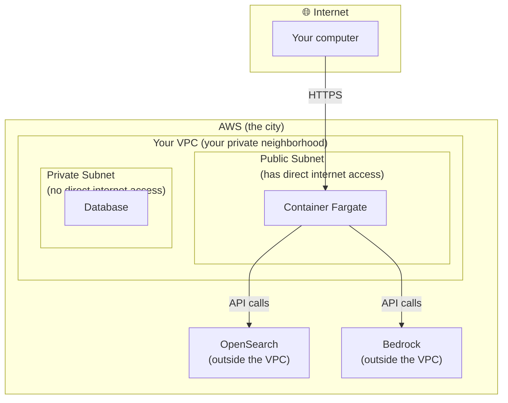
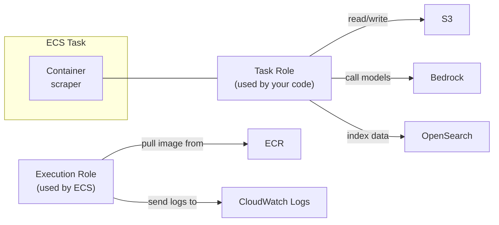
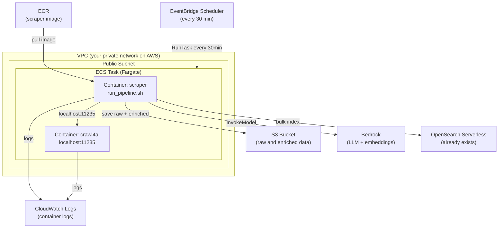
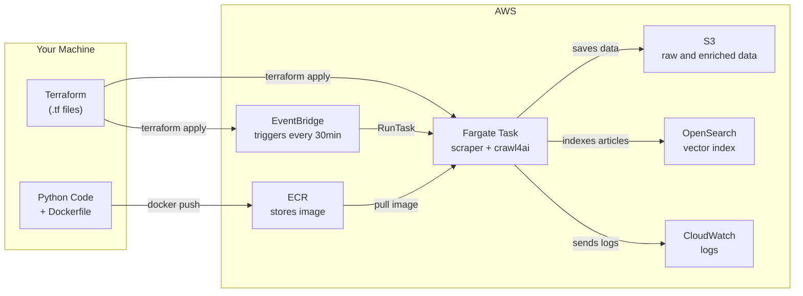

You have a Python application that works on your machine. It collects news, enriches articles with an LLM through Bedrock, and indexes everything in OpenSearch. It works perfectly when you run it manually, but now it needs to run automatically in the cloud every 30 minutes, even while you are asleep.

*How do you do that?*

This guide takes you from zero to a **scheduled job running on AWS Fargate**, walking through each real problem you will run into along the way. We will Dockerize the application, understand what a VPC is without the fluff, push the image to ECR, create the infrastructure with Terraform, and configure EventBridge Scheduler to trigger everything automatically.

The real application we use as the example is an AI news scraper: it collects articles from Google News, enriches them with Claude through Bedrock using a Crawl4AI sidecar to extract page content, and indexes them in OpenSearch.

**Methodology:** each section starts with a concrete problem and ends with that problem solved. We move from the simplest pieces to the most complex ones, so if something does not work in your environment, you will know exactly where the problem is.

---

## The Starting Point

The application has a clear CLI:

```bash
# 1. Collect articles from Google News
scraper run --connector google_news

# 2. Enrich with LLM (topic, description, abstract, tags)
scraper enrich run data/raw/google_news/2026-04-22/batch_123456.jsonl.gz

# 3. Index into OpenSearch (only this batch, not the whole directory)
scraper ingest run --data-dir data/enriched/google_news/2026-04-22 --file batch_123456.jsonl.gz
```

It works locally. The goal: make these three commands run automatically on AWS, inside a container, every 30 minutes.

---

## Part 1: Docker - Packaging the Application

### Problem 1: "It works here, but how do I make sure it works anywhere?"

Your local environment has Python 3.12, `uv`, and all dependencies installed. An AWS server has none of that. Every machine is different.

**Solution: Docker.** You create an image that contains everything: the right Python version, the right dependencies, and the code. That image runs the same way anywhere.

A useful analogy: before standardized shipping containers existed, each type of cargo required a different transportation method. Containers standardized everything. Docker did the same for software.

**Minimum concepts you need right now:**

| Concept | What it is |
|----------|---------|
| **Image** | A "package" with everything the app needs. Read-only. |
| **Container** | A running instance of an image. Like an isolated process. |
| **Dockerfile** | The recipe for building an image. |
| **Registry** | Where images are stored, like GitHub for images. |

### Your First Dockerfile (simple version)

Before creating the Dockerfile, generate the `uv` lockfile. It is the equivalent of npm's `package-lock.json`: it guarantees the installation is 100% identical on any machine or build:

```bash
# Run from the scraper directory
uv lock
```

This creates a `uv.lock` file. Commit it together with the code.

Now create the `Dockerfile` at the root of the scraper project:

```dockerfile
FROM ghcr.io/astral-sh/uv:latest AS uv-bin

FROM python:3.12-slim

COPY --from=uv-bin /uv /usr/local/bin/uv

WORKDIR /app

# Step 1: install dependencies only (cached layer)
COPY pyproject.toml uv.lock ./
RUN uv sync --frozen --no-dev --no-install-project

# Step 2: copy source and install the project (creates the "scraper" entry point)
COPY scraper/ scraper/
RUN uv sync --frozen --no-dev

ENV PATH="/app/.venv/bin:$PATH"

CMD ["scraper", "--help"]
```

Line by line:

| Instruction | What it does |
|-----------|-----------|
| `FROM ghcr.io/astral-sh/uv:latest AS uv-bin` | Downloads the official `uv` image, only to copy the binary |
| `FROM python:3.12-slim` | The real base image: official Python, slim version (~150MB) |
| `COPY --from=uv-bin /uv /usr/local/bin/uv` | Copies only the `uv` binary into the Python image |
| `WORKDIR /app` | Creates and enters the `/app` directory inside the container |
| `COPY pyproject.toml uv.lock ./` | Copies the dependency manifest and lockfile |
| `RUN uv sync --frozen --no-dev --no-install-project` | Installs **only** the dependencies from `uv.lock`, without trying to install the project itself |
| `COPY scraper/ scraper/` | Copies the application code |
| `RUN uv sync --frozen --no-dev` | Now installs the project, creating the `scraper` entry point in the virtual environment |
| `ENV PATH="/app/.venv/bin:$PATH"` | Adds the virtual environment to `PATH`, making `scraper` available as a command |
| `CMD ["scraper", "--help"]` | Default command when the container starts, just for testing |

> **Why two `uv sync` commands?** The `pyproject.toml` declares an entry point (`scraper = "scraper.main:cli"`). To create it, `uv sync` needs the source code. But we want to cache dependency installation, which is heavy and changes rarely. Splitting it into two steps solves that: the first one (`--no-install-project`) installs only dependencies as a cached layer, and the second installs the project after the code is available.

> **Why a multi-stage build?** The first `FROM` downloads the `uv` image only to extract the binary. The second `FROM` is the production image: slimmer, without unnecessary build tools. `COPY --from=uv-bin` copies only the `/uv` binary between stages.

Build and test:

```bash
# Run from the scraper directory
docker build -t scraper:hello .

# Verify the CLI is available
docker run --rm scraper:hello
```

If the `scraper` help appears, the image is functional. If you get an error, it is probably a missing file in `COPY`. See the debugging section below.

---

### Problem 2: "The build is copying unnecessary things and is slow"

By default, `docker build` copies **everything** from the current directory into the build context. That includes `.venv` (hundreds of MB), `data/` (GBs of articles), `.git/`, and other files that have nothing to do with the image.

The result: a slow build, a large image, and sometimes sensitive data accidentally ending up inside the image.

**Solution: `.dockerignore`**

Create a `.dockerignore` file at the project root:

```
# Virtual environment — rebuilt inside the container
.venv/

# Local data — never goes into the image
data/
logs/

# Git
.git/
.gitignore

# Environment variables — NEVER goes into the image
.env
*.env

# Python cache
__pycache__/
*.pyc
*.pyo
*.pyd

# Build artifacts
dist/
build/
*.egg-info/

# Terraform (if at the project root)
.terraform/
*.tfstate
```

Rebuild and compare:

```bash
docker build -t scraper:hello .
docker images scraper
```

You will notice the build gets faster: the context sent to Docker, the `transferring context:` line in the log, drops dramatically. The final image size does not change because the Dockerfile already uses selective `COPY` instructions, but `.dockerignore` protects you from future accidents, like a `COPY . .` that would pull `.env` or `data/` into the image.

---

### Problem 3: "Every time I change the code, the build reinstalls everything from scratch"

Docker uses a system of **cached layers**. Each line in the Dockerfile is a layer. If one layer changes, every following layer is rebuilt.

The problem: if you copy the code before installing dependencies, any code change invalidates the dependency cache, and `uv sync` runs again even if `pyproject.toml` did not change.

**Solution: copy dependencies first, code afterward.**

The Dockerfile from the previous section already uses the correct order: `pyproject.toml` and `uv.lock` come before `COPY scraper/`. But it is worth understanding why this matters.

```dockerfile
FROM ghcr.io/astral-sh/uv:latest AS uv-bin

FROM python:3.12-slim

COPY --from=uv-bin /uv /usr/local/bin/uv

WORKDIR /app

# Dependencies FIRST — this layer is cached as long as uv.lock doesn't change
COPY pyproject.toml uv.lock ./
RUN uv sync --frozen --no-dev --no-install-project

# Source code LAST — changes frequently but doesn't invalidate the cache above
COPY scraper/ scraper/
RUN uv sync --frozen --no-dev

ENV PATH="/app/.venv/bin:$PATH"

CMD ["scraper", "--help"]
```

Now edit any file in `scraper/` and rebuild:

```bash
docker build -t scraper:hello .
```

The first `uv sync` for dependencies will not run again; it will use the cache. Only the second one, which installs the project, runs, and it is instant. Day-to-day builds become much faster.

---

### Problem 4: "I need the container to read environment variables without putting secrets in the image"

The application needs `OPENSEARCH_HOST`, `AWS_REGION`, `AWS_S3_BUCKET`, and other variables. They **must not** be inside the image: images live in registries, can be inspected, and secrets inside them become security problems.

**Solution: runtime environment variables, not build-time variables.**

Docker accepts environment variables in `docker run`:

```bash
docker run --rm \
  -e AWS_REGION=us-east-1 \
  -e OPENSEARCH_HOST=my-endpoint.us-east-1.aoss.amazonaws.com \
  -e INDEX_NAME=newsletter-articles \
  -e AWS_S3_BUCKET=my-bucket \
  scraper:hello \
  scraper run --connector google_news --local
```

To test locally without repeating variables every time, you can use a `.env` file **together with `--env-file`**:

```bash
# .env (never commit this file)
AWS_REGION=us-east-1
OPENSEARCH_HOST=my-endpoint.us-east-1.aoss.amazonaws.com
INDEX_NAME=newsletter-articles
AWS_S3_BUCKET=my-bucket
```

```bash
docker run --rm --env-file .env scraper:hello scraper run --connector google_news --local
```

> **Important:** `--env-file` is different from copying `.env` into the image with `COPY`. With `--env-file`, values are injected only when the container runs. The image itself contains no secrets.

---

### Problem 5: "The enricher needs Crawl4AI running at `localhost:11235`; how do I run two containers together?"

The enricher uses Crawl4AI to extract content from web pages before passing it to the LLM. It expects to find Crawl4AI at `http://localhost:11235`. That is a separate service running in another container.

For local development, **Docker Compose** solves this: it defines multiple containers that run together and share networking.

**Solution: `docker-compose.yml` for local development**

Create `docker-compose.yml` at the root of the scraper project:

```yaml
services:
  crawl4ai:
    image: unclecode/crawl4ai:latest
    ports:
      - "11235:11235"
    healthcheck:
      test: ["CMD", "curl", "-f", "http://localhost:11235/health"]
      interval: 10s
      timeout: 5s
      retries: 5

  scraper:
    build: .
    network_mode: "service:crawl4ai"
    depends_on:
      crawl4ai:
        condition: service_healthy
    env_file: .env
    volumes:
      - ./data:/app/data
```

The Dockerfile `ENTRYPOINT` (`scripts/run_pipeline.sh`, which we will create in the next problem) will be the command that runs. Start everything with:

```bash
docker compose up
```

Compose makes sure `crawl4ai` is healthy before starting `scraper`.

> **Why `network_mode: "service:crawl4ai"`?** The enricher code is hardcoded to call `http://localhost:11235`. In normal Compose networking, each service has its own network namespace, so `localhost` inside the scraper points to itself, not to crawl4ai. `network_mode: "service:crawl4ai"` makes the scraper **share crawl4ai's network**, exactly like it will on Fargate. That makes `localhost:11235` work.

---

### Problem 6: "What if Crawl4AI is not ready when the scraper starts?"

In Compose, we use `depends_on` with `condition: service_healthy`. On Fargate, ECS has `dependsOn` with `condition: START`, but that only guarantees the container **started**, not that it is ready to receive requests.

Crawl4AI needs to download and initialize a Chromium browser, which can take 10 to 60 seconds. If the scraper tries to call it before that, it will fail.

**Solution: an entry script that waits for Crawl4AI to become available before starting.**

**Create `scripts/run_pipeline.sh`:**

```bash
#!/usr/bin/env bash
#
# Google News pipeline for Fargate: scrape → enrich → ingest
# Based on scripts/google_news_pipeline.sh (local/cron version)
#
set -euo pipefail

log() { echo "[$(date '+%H:%M:%S')] $*"; }

# ── Wait for Crawl4AI to be ready ──
log "=== Waiting for Crawl4AI on localhost:11235 ==="

python3 - <<'PY'
import socket, time, sys

for attempt in range(60):
    try:
        s = socket.socket()
        s.settimeout(2)
        s.connect(("127.0.0.1", 11235))
        s.close()
        print(f"  Crawl4AI ready after {attempt * 2}s")
        sys.exit(0)
    except Exception:
        time.sleep(2)

print("ERROR: Crawl4AI did not become ready within 120s", file=sys.stderr)
sys.exit(1)
PY

# ── 1. Scrape ──
log "=== Scrape ==="
OUTPUT=$(scraper run --connector google_news 2>&1 | tee /dev/stderr)

# Extract batch file path from scraper output
BATCH_FILE=$(echo "$OUTPUT" | grep -o 'data/raw/google_news/[^ ]*\.jsonl[^ ]*' | head -1)

if [ -z "${BATCH_FILE:-}" ]; then
    log "No batch produced. Exiting."
    exit 0
fi
log "Batch: $BATCH_FILE"

# ── 2. Enrich ──
log "=== Enrich ==="
scraper enrich run "$BATCH_FILE"

# ── 3. Ingest (only the batch we just enriched, not the whole directory) ──
BATCH_NAME=$(basename "$BATCH_FILE")
ENRICHED_DIR="data/enriched/google_news/$(date -u +%Y-%m-%d)"
ENRICHED_FILE="$ENRICHED_DIR/$BATCH_NAME"

if [ -f "$ENRICHED_FILE" ]; then
    log "=== Ingest ==="
    log "Ingesting: $ENRICHED_FILE"
    scraper ingest run --data-dir "$ENRICHED_DIR" --file "$BATCH_NAME"
else
    log "Enriched file not found at $ENRICHED_FILE, skipping ingest."
fi

log "=== Pipeline done ==="
```

Make the script executable:

```bash
chmod +x scripts/run_pipeline.sh
```

Now update the `Dockerfile` to use this script as the entrypoint:

```dockerfile
FROM ghcr.io/astral-sh/uv:latest AS uv-bin

FROM python:3.12-slim

COPY --from=uv-bin /uv /usr/local/bin/uv

WORKDIR /app

COPY pyproject.toml uv.lock ./
RUN uv sync --frozen --no-dev --no-install-project

COPY scraper/ scraper/
RUN uv sync --frozen --no-dev

ENV PATH="/app/.venv/bin:$PATH"

COPY scripts/run_pipeline.sh scripts/run_pipeline.sh
RUN chmod +x scripts/run_pipeline.sh

ENTRYPOINT ["scripts/run_pipeline.sh"]
```

Test locally with Compose:

```bash
docker compose up --build
```

If everything goes well, you will see the four steps in the log: waiting for Crawl4AI, scraping, enriching, and indexing.

---

## Part 2: VPC and Networking - Understanding the Terrain

Before uploading anything to AWS, we need to understand where the containers will run. That starts with understanding VPCs.

### What Is a VPC (ELI5 Version)

Imagine AWS as a huge city. Thousands of companies have servers in that city. If all servers were on the same public network, anyone could try to access any server.

**VPC (Virtual Private Cloud)** is like having a private neighborhood inside that city. You create your isolated network, and only what you authorize can enter or leave.



**Subnets** are subdivisions of the VPC, like blocks inside the neighborhood. There are two types:

- **Public subnet**: has a direct route to the internet. Containers here can receive and make external requests directly.
- **Private subnet**: has no direct route to the internet. To reach the outside, it needs a NAT Gateway, a "doorman" that makes requests on its behalf.

**Why does this matter for our case?**

The scraper needs to:
1. Make requests to the internet (fetch articles from Google News)
2. Call Bedrock (an AWS service)
3. Write to OpenSearch Serverless (an AWS service)
4. Write to S3 (an AWS service)

For that, the container needs internet access: either through a public subnet, which is simpler and appropriate for a PoC, or through a private subnet with a NAT Gateway, which is safer and more expensive.

**To start: we will use a public subnet with a public IP assigned.** It is the simplest and most direct path to a first working deployment.

### How to Find Your Account's VPC and Subnets

AWS creates a **default VPC** in each region when you create the account. It is the simplest one to use when getting started. To find it:

```bash
# Find the default VPC
aws ec2 describe-vpcs \
  --filters "Name=isDefault,Values=true" \
  --profile homegenius-admin \
  --region us-east-1 \
  --query "Vpcs[0].VpcId" \
  --output text
# Output: vpc-xxxxxxxxxx

# Find subnets in that VPC
aws ec2 describe-subnets \
  --filters "Name=vpc-id,Values=<VPC_ID_ABOVE>" \
  --profile homegenius-admin \
  --region us-east-1 \
  --query "Subnets[*].[SubnetId,AvailabilityZone,MapPublicIpOnLaunch]" \
  --output table
```

Write down the `vpc-id` and at least two `subnet-id` values that have `MapPublicIpOnLaunch = True` (public subnets). We will need them in `terraform.tfvars`.

### Security Groups: The Container's "Firewall"

Inside the VPC, the **Security Group** is the firewall that controls what enters and leaves each resource. For our scraper:

- **Inbound (ingress):** none. The container does not receive external connections.
- **Outbound (egress):** everything allowed. The container needs to call the internet, Bedrock, OpenSearch, and S3.

Terraform will create this automatically. I am explaining it so you understand what is being created.

---

## Part 3: ECR and S3 - Where the Image and Data Live

**ECR (Elastic Container Registry)** is AWS's "GitHub for Docker images." Instead of using the public Docker Hub, you use ECR inside your own account, which is safer and integrated with IAM.

The ECR flow is:
1. Create the ECR repository (once)
2. Build the image locally
3. Authenticate Docker with ECR
4. Push the image
5. Fargate will pull that image when it runs the task

We will create ECR together with the rest of the infrastructure in Terraform (Part 5). But first, let's test S3.

### Testing S3 Before Everything Else

Before moving on to the full infrastructure, let's test whether S3 is working correctly with the application. The scraper saves raw data to S3 when `AWS_S3_BUCKET` is configured.

> **Note:** here we will create a test bucket through the CLI. When we run Terraform in Part 7, it will create the final bucket with versioning, encryption, and public access blocking. The test bucket can be removed later with `aws s3 rb s3://NAME --force`.

**Step 1: Create a test bucket through the CLI**

```bash
# Pick a unique name (S3 bucket names are global across all AWS accounts)
BUCKET_NAME="newsletter-scraper-test-$(aws sts get-caller-identity \
  --profile homegenius-admin \
  --query Account \
  --output text)"

echo "Bucket name: ${BUCKET_NAME}"

aws s3 mb "s3://${BUCKET_NAME}" \
  --region us-east-1 \
  --profile homegenius-admin
```

**Step 2: Test the upload manually**

```bash
# Create a test file
echo '{"test": "hello s3"}' > /tmp/test.jsonl

# Upload
aws s3 cp /tmp/test.jsonl "s3://${BUCKET_NAME}/test/hello.jsonl" \
  --profile homegenius-admin

# Confirm it arrived
aws s3 ls "s3://${BUCKET_NAME}/test/" \
  --profile homegenius-admin
```

**Step 3: Run the scraper locally pointing to S3**

```bash
# Append to .env
echo "AWS_S3_BUCKET=${BUCKET_NAME}" >> .env

# Run (without --local, so it goes to S3)
source .venv/bin/activate
scraper run --connector google_news

# Verify files arrived in S3
aws s3 ls "s3://${BUCKET_NAME}/raw/google_news/" \
  --profile homegenius-admin \
  --recursive
```

If `.jsonl.gz` files appear in S3, the output pipeline is working.

**Step 4: Clean up the test bucket when you no longer need it**

```bash
aws s3 rb "s3://${BUCKET_NAME}" --force --profile homegenius-admin
```

---

## Part 4: IAM - Permissions on AWS

### The Most Important IAM Concept

On AWS, by default, **nothing has permission to do anything**. Every service, container, or resource needs explicit permission to access other services.

For our scraper, we will have two types of role:



**Execution Role** = AWS needs this to *start* the container (pull the image, send logs)

**Task Role** = your code needs this to *run* (access S3, Bedrock, OpenSearch)

They are two different roles with different purposes. Mixing them up is one of the most common mistakes.

### OpenSearch Serverless: the Extra IAM Layer

OpenSearch Serverless has an authorization layer beyond IAM: the **Data Access Policy**. Even if the Task Role has `aoss:APIAccessAll`, you also need to add the role ARN to the collection's data access policy.

In deployment Step 7, we will go through this full process with AWS CLI commands.

---

## Part 5: Terraform - Infrastructure as Code

### Why Terraform Instead of the AWS Console?

You could create everything through the AWS Console by clicking buttons. It works, but it has problems:

- Hard to reproduce (what if you need to create it in another region?)
- Hard to audit (who created what, and when?)
- Impossible to version in git
- If something goes wrong, you do not know the exact previous state

Terraform solves all of this: you write what you want to exist, and Terraform creates, updates, or destroys resources to reach that state.

**The basic cycle:**

```bash
terraform init    # Download required plugins (first time only)
terraform plan    # Preview what will be created/changed/destroyed
terraform apply   # Execute the plan
terraform destroy # Tear everything down (use with care!)
```

`terraform plan` is your best friend. Always run it before `apply` and read what will be created.

### File Structure

Create the scraper infrastructure directory:

```
newsletter-application/
├── infra/              ← EC2/backend/frontend infra (already exists, do not touch)
└── scraper/
    ├── infra/          ← new Fargate infra (we will create it here)
    │   ├── main.tf
    │   ├── variables.tf
    │   ├── iam.tf
    │   ├── ecr.tf
    │   ├── s3.tf
    │   ├── ecs.tf
    │   ├── scheduler.tf
    │   ├── outputs.tf
    │   └── terraform.tfvars
    ├── scraper/
    ├── scripts/
    ├── Dockerfile
    └── pyproject.toml
```

> **Why `scraper/infra/` and not together with the existing `infra/`?** Isolation. If something goes wrong here, it does not affect the backend and frontend already in production. Terraform keeps a separate **state** for each directory, so these are independent infrastructures.

### What Terraform Will Create

Before looking at the code, understand the full architecture:



**Resources Terraform will create:**

| Resource | Purpose |
|---------|---------|
| `aws_ecr_repository` | Store the scraper image |
| `aws_s3_bucket` | Store raw and enriched data |
| `aws_cloudwatch_log_group` | Centralize container logs |
| `aws_ecs_cluster` | Logical grouping for tasks |
| `aws_ecs_task_definition` | The container "template" (2 containers: scraper + crawl4ai) |
| `aws_iam_role` (3x) | Execution role, task role, scheduler role |
| `aws_security_group` | Container firewall |
| `aws_scheduler_schedule` | Trigger every 30 minutes |

---

### The Terraform Files

**`main.tf`**

```hcl
terraform {
  required_version = ">= 1.5"

  required_providers {
    aws = {
      source  = "hashicorp/aws"
      version = "~> 5.90"
    }
  }
}

provider "aws" {
  region  = var.aws_region
  profile = var.aws_profile

  default_tags {
    tags = {
      Project = "newsletter-scraper"
    }
  }
}

data "aws_caller_identity" "current" {}
```

---

**`variables.tf`**

```hcl
variable "aws_region" {
  type    = string
  default = "us-east-1"
}

variable "aws_profile" {
  type    = string
  default = "homegenius-admin"
}

variable "project_name" {
  type    = string
  default = "newsletter-scraper"
}

variable "image_tag" {
  type    = string
  default = "latest"
}

variable "crawl4ai_image" {
  type    = string
  default = "unclecode/crawl4ai:latest"
}

variable "schedule_expression" {
  type    = string
  default = "rate(30 minutes)"
}

variable "vpc_id" {
  type        = string
  description = "VPC ID where the container will run (e.g. vpc-xxxxxxxxxx)"
}

variable "subnet_ids" {
  type        = list(string)
  description = "Public subnet IDs (e.g. [\"subnet-aaa\", \"subnet-bbb\"])"
}

variable "opensearch_host" {
  type        = string
  description = "OpenSearch Serverless host (without https://)"
}

variable "opensearch_collection_arn" {
  type        = string
  description = "ARN of the OpenSearch Serverless collection"
}

variable "index_name" {
  type    = string
  default = "newsletter-articles"
}

variable "embedding_model_id" {
  type    = string
  default = "amazon.titan-embed-text-v2:0"
}

variable "bedrock_model_id" {
  type    = string
  default = "us.anthropic.claude-haiku-4-5-20251001-v1:0"
}

variable "tavily_secret_arn" {
  type        = string
  default     = ""
  description = "ARN of the Tavily API key secret in Secrets Manager (optional)"
}
```

---

**`ecr.tf`**

```hcl
resource "aws_ecr_repository" "scraper" {
  name                 = "newsletter/scraper"
  image_tag_mutability = "MUTABLE"
  force_delete         = true

  image_scanning_configuration {
    scan_on_push = true
  }
}
```

---

**`s3.tf`**

```hcl
resource "aws_s3_bucket" "artifacts" {
  bucket = "${var.project_name}-${data.aws_caller_identity.current.account_id}-${var.aws_region}"
}

resource "aws_s3_bucket_versioning" "artifacts" {
  bucket = aws_s3_bucket.artifacts.id

  versioning_configuration {
    status = "Enabled"
  }
}

resource "aws_s3_bucket_server_side_encryption_configuration" "artifacts" {
  bucket = aws_s3_bucket.artifacts.id

  rule {
    apply_server_side_encryption_by_default {
      sse_algorithm = "AES256"
    }
  }
}

resource "aws_s3_bucket_public_access_block" "artifacts" {
  bucket = aws_s3_bucket.artifacts.id

  block_public_acls       = true
  block_public_policy     = true
  ignore_public_acls      = true
  restrict_public_buckets = true
}
```

> The bucket name uses the Account ID to guarantee global uniqueness. S3 bucket names are unique across all of AWS, not just within your account.

---

**`iam.tf`**

```hcl
# ──────────────────────────────────────────────
# Execution Role — used by ECS to start the container
# ──────────────────────────────────────────────
resource "aws_iam_role" "ecs_execution" {
  name = "${var.project_name}-execution-role"

  assume_role_policy = jsonencode({
    Version = "2012-10-17"
    Statement = [{
      Action    = "sts:AssumeRole"
      Effect    = "Allow"
      Principal = { Service = "ecs-tasks.amazonaws.com" }
    }]
  })
}

resource "aws_iam_role_policy_attachment" "ecs_execution_managed" {
  role       = aws_iam_role.ecs_execution.name
  policy_arn = "arn:aws:iam::aws:policy/service-role/AmazonECSTaskExecutionRolePolicy"
}

# Extra permission to read Secrets Manager (Tavily API key)
resource "aws_iam_role_policy" "ecs_execution_secrets" {
  count = var.tavily_secret_arn != "" ? 1 : 0

  name = "${var.project_name}-execution-secrets"
  role = aws_iam_role.ecs_execution.id

  policy = jsonencode({
    Version = "2012-10-17"
    Statement = [{
      Effect   = "Allow"
      Action   = ["secretsmanager:GetSecretValue"]
      Resource = [var.tavily_secret_arn]
    }]
  })
}

# ──────────────────────────────────────────────
# Task Role — used by application code inside the container
# ──────────────────────────────────────────────
resource "aws_iam_role" "ecs_task" {
  name = "${var.project_name}-task-role"

  assume_role_policy = jsonencode({
    Version = "2012-10-17"
    Statement = [{
      Action    = "sts:AssumeRole"
      Effect    = "Allow"
      Principal = { Service = "ecs-tasks.amazonaws.com" }
    }]
  })
}

resource "aws_iam_role_policy" "ecs_task_s3" {
  name = "${var.project_name}-task-s3"
  role = aws_iam_role.ecs_task.id

  policy = jsonencode({
    Version = "2012-10-17"
    Statement = [{
      Effect = "Allow"
      Action = ["s3:PutObject", "s3:GetObject", "s3:ListBucket"]
      Resource = [
        aws_s3_bucket.artifacts.arn,
        "${aws_s3_bucket.artifacts.arn}/*"
      ]
    }]
  })
}

resource "aws_iam_role_policy" "ecs_task_bedrock" {
  name = "${var.project_name}-task-bedrock"
  role = aws_iam_role.ecs_task.id

  policy = jsonencode({
    Version = "2012-10-17"
    Statement = [{
      Effect   = "Allow"
      Action   = ["bedrock:InvokeModel", "bedrock:InvokeModelWithResponseStream"]
      Resource = ["*"]
    }]
  })
}

resource "aws_iam_role_policy" "ecs_task_opensearch" {
  name = "${var.project_name}-task-opensearch"
  role = aws_iam_role.ecs_task.id

  policy = jsonencode({
    Version = "2012-10-17"
    Statement = [{
      Effect   = "Allow"
      Action   = ["aoss:APIAccessAll"]
      Resource = [var.opensearch_collection_arn]
    }]
  })
}

# ──────────────────────────────────────────────
# Scheduler Role — used by EventBridge to invoke ECS
# ──────────────────────────────────────────────
resource "aws_iam_role" "scheduler" {
  name = "${var.project_name}-scheduler-role"

  assume_role_policy = jsonencode({
    Version = "2012-10-17"
    Statement = [{
      Action    = "sts:AssumeRole"
      Effect    = "Allow"
      Principal = { Service = "scheduler.amazonaws.com" }
    }]
  })
}

resource "aws_iam_role_policy" "scheduler_run_task" {
  name = "${var.project_name}-scheduler-run-task"
  role = aws_iam_role.scheduler.id

  policy = jsonencode({
    Version = "2012-10-17"
    Statement = [
      {
        Effect   = "Allow"
        Action   = ["ecs:RunTask"]
        Resource = ["${aws_ecs_task_definition.scraper.arn_without_revision}:*"]
      },
      {
        Effect = "Allow"
        Action = ["iam:PassRole"]
        Resource = [
          aws_iam_role.ecs_execution.arn,
          aws_iam_role.ecs_task.arn
        ]
      }
    ]
  })
}
```

> **Why does the Scheduler need `iam:PassRole`?** When EventBridge calls ECS to create a task, it needs to "pass" both roles (execution + task) to ECS. Without this `PassRole`, ECS refuses because it does not trust that the Scheduler has the right to use those roles.
>
> **Why `arn_without_revision:*` in `ecs:RunTask`?** Every time you change the task definition, such as changing CPU or adding an environment variable, Terraform creates a **new revision** (for example, `newsletter-scraper:2`). If the policy pointed to the ARN with a fixed revision (`:1`), the Scheduler would lose permission after any update. The `:*` wildcard allows any revision.

---

**`ecs.tf`**

```hcl
resource "aws_cloudwatch_log_group" "scraper" {
  name              = "/ecs/${var.project_name}"
  retention_in_days = 14
}

resource "aws_ecs_cluster" "scraper" {
  name = "${var.project_name}-cluster"
}

resource "aws_security_group" "scraper_task" {
  name        = "${var.project_name}-task-sg"
  description = "Scraper ECS task — outbound to internet allowed, no inbound"
  vpc_id      = var.vpc_id

  egress {
    description = "Full outbound to internet (Bedrock, OpenSearch, Google News)"
    from_port   = 0
    to_port     = 0
    protocol    = "-1"
    cidr_blocks = ["0.0.0.0/0"]
  }
}

locals {
  scraper_image_uri = "${aws_ecr_repository.scraper.repository_url}:${var.image_tag}"

  # Environment variables for the scraper container
  scraper_env = [
    { name = "AWS_REGION",          value = var.aws_region },
    { name = "OPENSEARCH_HOST",     value = var.opensearch_host },
    { name = "INDEX_NAME",          value = var.index_name },
    { name = "EMBEDDING_MODEL_ID",  value = var.embedding_model_id },
    { name = "BEDROCK_MODEL_ID",    value = var.bedrock_model_id },
    { name = "AWS_S3_BUCKET",       value = aws_s3_bucket.artifacts.bucket },
  ]

  # If Tavily secret is configured, inject it via secretsFrom
  tavily_secrets = var.tavily_secret_arn != "" ? [
    {
      name      = "TAVILY_API_KEY"
      valueFrom = var.tavily_secret_arn
    }
  ] : []

  container_definitions = jsonencode([
    {
      name      = "crawl4ai"
      image     = var.crawl4ai_image
      essential = true

      portMappings = [{
        containerPort = 11235
        hostPort      = 11235
        protocol      = "tcp"
      }]

      logConfiguration = {
        logDriver = "awslogs"
        options = {
          "awslogs-group"         = aws_cloudwatch_log_group.scraper.name
          "awslogs-region"        = var.aws_region
          "awslogs-stream-prefix" = "crawl4ai"
        }
      }
    },
    {
      name      = "scraper"
      image     = local.scraper_image_uri
      essential = true

      dependsOn = [{
        containerName = "crawl4ai"
        condition     = "START"
      }]

      environment = local.scraper_env
      secrets     = local.tavily_secrets

      logConfiguration = {
        logDriver = "awslogs"
        options = {
          "awslogs-group"         = aws_cloudwatch_log_group.scraper.name
          "awslogs-region"        = var.aws_region
          "awslogs-stream-prefix" = "scraper"
        }
      }
    }
  ])
}

resource "aws_ecs_task_definition" "scraper" {
  family                   = var.project_name
  requires_compatibilities = ["FARGATE"]
  network_mode             = "awsvpc"
  cpu                      = "2048"
  memory                   = "4096"
  execution_role_arn       = aws_iam_role.ecs_execution.arn
  task_role_arn            = aws_iam_role.ecs_task.arn
  container_definitions    = local.container_definitions

  runtime_platform {
    operating_system_family = "LINUX"
    cpu_architecture        = "X86_64"
  }
}
```

> **Why 2 vCPU and 4GB?** Crawl4AI uses a headless browser (Chromium), which is heavy. 1 vCPU and 2GB are enough only for lighter apps. After you see the logs from the first run, you can tune this down if you want to save money.

> **`condition: "START"` vs `"HEALTHY"`:** `START` means "the crawl4ai container started." `HEALTHY` would require a `healthcheck` configured in the task definition, which would add complexity. That is why we use `START` here and handle the waiting in `run_pipeline.sh`, which already has a 120-second loop checking `localhost:11235`.

---

**`scheduler.tf`**

```hcl
resource "aws_scheduler_schedule" "scraper" {
  name                         = "${var.project_name}-schedule"
  schedule_expression          = var.schedule_expression
  schedule_expression_timezone = "UTC"
  state                        = "ENABLED"

  flexible_time_window {
    mode = "OFF"
  }

  target {
    arn      = aws_ecs_cluster.scraper.arn
    role_arn = aws_iam_role.scheduler.arn

    ecs_parameters {
      task_definition_arn = aws_ecs_task_definition.scraper.arn
      launch_type         = "FARGATE"
      task_count          = 1
      platform_version    = "LATEST"

      network_configuration {
        subnets          = var.subnet_ids
        security_groups  = [aws_security_group.scraper_task.id]
        assign_public_ip = true
      }
    }

    retry_policy {
      maximum_retry_attempts = 1
    }
  }
}
```

> **`flexible_time_window = "OFF"`:** the job runs exactly at the configured time. If you used `FLEXIBLE`, AWS would have a window of up to N minutes to run it at any point. For a scraper, we want deterministic timing.

> **`retry_policy.maximum_retry_attempts = 1`:** if the task fails, the Scheduler will try once more. Without this, silent failures can go unnoticed.

---

**`outputs.tf`**

```hcl
output "ecr_repository_url" {
  value       = aws_ecr_repository.scraper.repository_url
  description = "ECR repository URL — use for docker push"
}

output "s3_bucket_name" {
  value       = aws_s3_bucket.artifacts.bucket
  description = "Artifacts S3 bucket name"
}

output "ecs_cluster_name" {
  value = aws_ecs_cluster.scraper.name
}

output "task_role_arn" {
  value       = aws_iam_role.ecs_task.arn
  description = "Task role ARN — add to the OpenSearch data access policy"
}

output "log_group_name" {
  value       = aws_cloudwatch_log_group.scraper.name
  description = "CloudWatch log group name"
}
```

---

**`terraform.tfvars`**

```hcl
aws_region   = "us-east-1"
aws_profile  = "homegenius-admin"
project_name = "newsletter-scraper"
image_tag    = "latest"

schedule_expression = "rate(30 minutes)"

# Fill in with results from: aws ec2 describe-vpcs and describe-subnets
vpc_id     = "vpc-xxxxxxxxxx"
subnet_ids = ["subnet-aaaaaaa", "subnet-bbbbbbb"]

# Your OpenSearch endpoint (without https://)
opensearch_host           = "xxxxxxxxxxxx.us-east-1.aoss.amazonaws.com"
opensearch_collection_arn = "arn:aws:aoss:us-east-1:123456789012:collection/xxxxxxxxxx"

index_name         = "newsletter-articles"
embedding_model_id = "amazon.titan-embed-text-v2:0"
bedrock_model_id   = "us.anthropic.claude-haiku-4-5-20251001-v1:0"

# Leave empty if not using Tavily
tavily_secret_arn = ""
```

---

## Part 6: Tavily API Key in Secrets Manager (Optional, but Correct)

If you want to use the Tavily API Key, do not put it directly in an environment variable. Environment variables can appear in logs, in the AWS Console, and in auditing tools.

The right place is **AWS Secrets Manager**.

**Step 1: Create the secret through the CLI**

```bash
aws secretsmanager create-secret \
  --name "newsletter-scraper/tavily-api-key" \
  --secret-string "tvly-dev-xxxxxxxxxxxx" \
  --region us-east-1 \
  --profile homegenius-admin
```

Write down the returned ARN. It looks something like:
```
arn:aws:secretsmanager:us-east-1:123456789012:secret:newsletter-scraper/tavily-api-key-AbCdEf
```

**Step 2: Add it to `terraform.tfvars`**

```hcl
tavily_secret_arn = "arn:aws:secretsmanager:us-east-1:123456789012:secret:newsletter-scraper/tavily-api-key-AbCdEf"
```

When configured, Terraform will:
1. Give the Execution Role permission to read this secret
2. Inject the value as the `TAVILY_API_KEY` environment variable in the container at runtime

The value is never stored in the task definition as plaintext. ECS fetches it from Secrets Manager when starting the container.

---

## Part 7: Step-by-Step Deployment

Now that you understand each piece, here is the deployment checklist in the correct order.

### Pre-Deployment Checklist

Before running any Terraform, confirm:

- [ ] `aws sts get-caller-identity --profile homegenius-admin` works (valid credentials)
- [ ] You have the `vpc_id` and at least two `subnet_ids` ready
- [ ] You have the `opensearch_host` and `opensearch_collection_arn`
- [ ] Local S3 was tested (Part 3)
- [ ] Local Docker was tested (Part 1)
- [ ] `terraform.tfvars` is filled in

### Step 1: Initialize Terraform

```bash
cd scraper/infra

terraform init
```

This downloads the AWS provider. You will see something like:
```
Terraform has been successfully initialized!
```

### Step 2: See What Will Be Created

```bash
terraform plan
```

Read carefully. You will see something like:
```
Plan: 14 to add, 0 to change, 0 to destroy.
```

Confirm there is nothing unexpected, especially no `to destroy`.

### Step 3: Create ECR and S3 First

```bash
terraform apply -target=aws_ecr_repository.scraper -target=aws_s3_bucket.artifacts
```

> **Why separately?** Because the next step is pushing the image to ECR. If ECR does not exist yet, `docker push` will fail. We create ECR first, then push the image, then apply the rest.

Confirm with `yes` when prompted.

### Step 4: Get the ECR URL

```bash
terraform output ecr_repository_url
# Output: 123456789012.dkr.ecr.us-east-1.amazonaws.com/newsletter/scraper
```

### Step 5: Build and Push the Image

```bash
# Store ECR URL in a variable
ECR_URL=$(terraform output -raw ecr_repository_url)
ACCOUNT_ID=$(echo $ECR_URL | cut -d. -f1)

# Authenticate Docker with ECR
aws ecr get-login-password \
  --region us-east-1 \
  --profile homegenius-admin \
  | docker login --username AWS --password-stdin "${ACCOUNT_ID}.dkr.ecr.us-east-1.amazonaws.com"

# Build the image (from the scraper directory, not infra/)
cd ..
docker build --platform linux/amd64 -t newsletter-scraper:latest .

# Tag for ECR
docker tag newsletter-scraper:latest "${ECR_URL}:latest"

# Push
docker push "${ECR_URL}:latest"
```

> **`--platform linux/amd64`:** if you are on a Mac with Apple Silicon (M1/M2/M3/M4), Docker builds ARM images by default. Fargate with `cpu_architecture = "X86_64"` needs amd64 images. Without this flag, the container will fail with `exec format error` on Fargate.

Confirm it arrived:
```bash
aws ecr list-images \
  --repository-name newsletter/scraper \
  --profile homegenius-admin \
  --region us-east-1
```

### Step 6: Apply the Rest of the Infrastructure

```bash
cd infra
terraform apply
```

Confirm with `yes`. Terraform will create the ECS cluster, IAM roles, security group, task definition, and Scheduler.

### Step 7: Add the Task Role to the OpenSearch Data Access Policy

This step is mandatory. Without it, the container cannot write to OpenSearch.

**Step 7.1: Get the task role ARN**

```bash
terraform output task_role_arn
# Output: arn:aws:iam::123456789012:role/newsletter-scraper-task-role
```

**Step 7.2: Find the data access policy name**

```bash
aws opensearchserverless list-access-policies \
  --type data \
  --profile homegenius-admin \
  --region us-east-1
```

Write down the `name` of the policy that covers your collection.

**Step 7.3: Read the current policy**

```bash
aws opensearchserverless get-access-policy \
  --type data \
  --name <policy-name> \
  --profile homegenius-admin \
  --region us-east-1 \
  --output json
```

Write down the `policyVersion` (for example: `"MTY..."`). You will need it in the next step.

In the `policy` field, you will see JSON with a `Principal` array. Add the task role ARN to that array.

**Step 7.4: Update the policy with the new role**

```bash
aws opensearchserverless update-access-policy \
  --type data \
  --name <policy-name> \
  --policy-version <policyVersion-from-previous-step> \
  --profile homegenius-admin \
  --region us-east-1 \
  --policy '[
    {
      "Rules": [
        {
          "ResourceType": "index",
          "Resource": ["index/*/*"],
          "Permission": ["aoss:*"]
        },
        {
          "ResourceType": "collection",
          "Resource": ["collection/ipd-test-collection"],
          "Permission": ["aoss:*"]
        }
      ],
      "Principal": [
        "arn:aws:iam::123456789012:role/existing-role",
        "arn:aws:iam::123456789012:role/newsletter-scraper-task-role"
      ]
    }
  ]'
```

> Replace the JSON with the real content returned in step 7.3, adding only the task role ARN to the `Principal` array. Do not change the existing `Rules`.

### Step 8: Manual Test - Trigger the Task

Before waiting for the schedule, test manually:

```bash
# Look up cluster name and task definition ARN
CLUSTER=$(terraform output -raw ecs_cluster_name)
TASK_DEF=$(terraform output -raw task_definition_arn 2>/dev/null || \
  aws ecs describe-task-definition \
    --task-definition newsletter-scraper \
    --profile homegenius-admin \
    --region us-east-1 \
    --query "taskDefinition.taskDefinitionArn" \
    --output text)

# Run the task manually
aws ecs run-task \
  --cluster "${CLUSTER}" \
  --task-definition newsletter-scraper \
  --launch-type FARGATE \
  --network-configuration "awsvpcConfiguration={subnets=[subnet-aaa,subnet-bbb],securityGroups=[sg-xxxxxxxxx],assignPublicIp=ENABLED}" \
  --profile homegenius-admin \
  --region us-east-1
```

### Step 9: Follow the Logs

```bash
# Get the log group name
LOG_GROUP=$(terraform output -raw log_group_name)

# Stream scraper container logs in real time
aws logs tail "${LOG_GROUP}" \
  --follow \
  --log-stream-name-prefix scraper \
  --profile homegenius-admin \
  --region us-east-1
```

You will see the progress of the four steps: waiting for Crawl4AI, scraping, enriching, and indexing.

---

## Part 8: Debugging - When Something Goes Wrong

### "The Task Stops Immediately With No Logs"

It is usually one of these problems:

**The container cannot pull the image:**
- Execution Role has no ECR permission -> check that `AmazonECSTaskExecutionRolePolicy` is attached
- Image does not exist in ECR -> confirm with `aws ecr list-images`
- Container has no route to the internet -> check that the subnet is public and `assign_public_ip = true`

**`exec format error`:**
You built the image without `--platform linux/amd64` on an Apple Silicon Mac. Fargate expects amd64, but the image is ARM. Rebuild with the flag and push again.

**Entry script with a syntax error:**
```bash
# Test locally first
docker run --rm scraper:latest scripts/run_pipeline.sh
```

### "The Scraper Starts but Fails During Enrichment"

Crawl4AI is probably not ready in time. In the `crawl4ai` container log, look for:
```
Uvicorn running on http://0.0.0.0:11235
```

If this line appears after the scraper already tried to start, the 120-second wait loop should cover it. If Crawl4AI takes more than 120 seconds to start, increase the timeout in the script.

### "OpenSearch Returns 403 Forbidden"

Two possible problems:

1. **Task Role has no IAM permission**: confirm that `aoss:APIAccessAll` is in the task role with the correct collection ARN
2. **Data Access Policy not updated**: the task role needs to be in the collection's data access policy

### "Bedrock Returns AccessDeniedException"

Confirm that:
- The region is correct (Bedrock cross-region inference requires the `us.` prefix in the model ID for us-east-1)
- The task role has `bedrock:InvokeModel`
- The model is enabled in your account (in the console: Bedrock -> Model Access)

### Useful Command: See All Recent Tasks

```bash
aws ecs list-tasks \
  --cluster newsletter-scraper-cluster \
  --profile homegenius-admin \
  --region us-east-1

# Get status and failure reason for a specific task
aws ecs describe-tasks \
  --cluster newsletter-scraper-cluster \
  --tasks <TASK_ARN> \
  --profile homegenius-admin \
  --region us-east-1 \
  --query "tasks[0].{status:lastStatus,stopReason:stoppedReason,containers:containers[*].{name:name,status:lastStatus,reason:reason}}"
```

---

## Part 9: Next Steps

With Google News + enrichment working, you have the foundation. Here is what to add next:

### Add the Research Agent

The `research_agent` needs the Tavily API Key to work well. If you already configured Secrets Manager in Part 6, just change `run_pipeline.sh` to include:

```bash
scraper run --connector research_agent
```

Then update the Dockerfile and push again.

### Improve Reliability

**Dead Letter Queue:** if the job fails both attempts (retry policy), you want to know. Configure an SNS topic or SQS queue as a DLQ in the Scheduler to receive failure alerts.

**CloudWatch Alarm:** create an alarm that fires if no log appears in the log group for more than 1 hour.

### Layered Security

**Private subnet + NAT Gateway:** safer because the container has no public IP, but costs about ~$32/month for the NAT. Evaluate this when the project moves beyond the PoC.

**Least privilege in S3:** restrict actions by prefix (`raw/*`, `enriched/*`) instead of granting access to the entire bucket.

### Update the Image

The code update cycle is:

```bash
# 1. Make code changes
# 2. Rebuild the image
docker build --platform linux/amd64 -t newsletter-scraper:latest .

# 3. Tag + push to ECR
docker tag newsletter-scraper:latest "${ECR_URL}:latest"
docker push "${ECR_URL}:latest"

# 4. The next Scheduler run will pick up the new image automatically
#    (because the tag is "latest" and image_tag_mutability = "MUTABLE")
```

You do not need `terraform apply` to update code, only for infrastructure changes.

---

## Summary: What Each Piece Does



- **Docker**: packages your app and environment into a portable artifact
- **ECR**: stores that artifact inside your AWS account
- **Fargate**: runs the container without you managing a server
- **ECS Task Definition**: describes which containers to run, with how much CPU/memory, and with which permissions
- **EventBridge Scheduler**: triggers the task at the right time
- **IAM**: ensures each service accesses only what it needs
- **VPC/Security Group**: isolates the container network
- **S3**: persistent storage (the container disk is temporary)
- **Terraform**: manages all this infrastructure as versionable code
