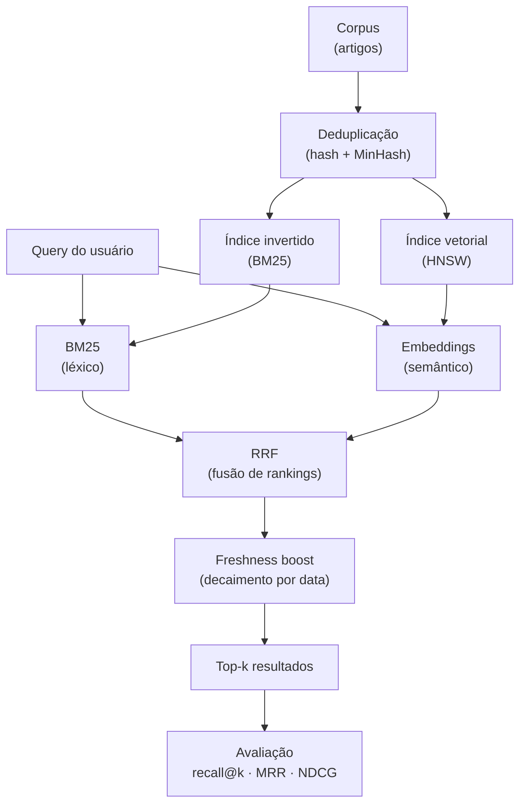

Você já usou OpenSearch, Elasticsearch ou FAISS. Sabe criar um pipeline de RAG. Consegue fazer uma busca semântica funcionar.

Mas se alguém te perguntar "como funciona um search engine de verdade por dentro?" — você provavelmente consegue dizer "usa índice invertido e BM25", mas não muito além disso.

Este artigo é para fechar esse gap.

Vamos construir um mini search engine do zero em Python, adicionando peças conforme novos problemas aparecem. No final, você vai entender não só *o que* ferramentas como OpenSearch fazem, mas *por que* elas fazem — e conseguirá distinguir um sistema de busca didático de infraestrutura de busca real.

> Todos os exemplos estão em um **[Jupyter Notebook](https://github.com/WittmannF/wittmannf.github.io/tree/main/public/blog/information-retrieval-guide)** para você rodar célula a célula.

---

## O que é Information Retrieval?

**Information Retrieval (IR)** é a área que estuda como encontrar material relevante dentro de coleções grandes de documentos não-estruturados, dada uma necessidade de informação.

A definição clássica:

> *"Information retrieval is finding material (usually documents) of an unstructured nature (usually text) that satisfies an information need from within large collections."*
> — Manning, Raghavan & Schütze

A palavra mais importante ali é **satisfies**. Não é "encontrar documentos que contêm as palavras da query". É encontrar documentos que satisfazem a *necessidade* do usuário — que é uma coisa muito mais difícil.

---

## IR, Search, Database Query, RAG, Vector Search — qual a diferença?

Esses conceitos vivem no mesmo bairro mas são vizinhos bem diferentes.

**Database Query**: você conhece o schema, sabe os campos, escreve `WHERE nome = 'Fernando' AND cidade = 'SP'`. O banco retorna exatamente o que você pediu. Sem tolerância a variações, sem ranking por relevância.

**Information Retrieval / Search**: texto livre, sem schema. O usuário digita "como aprender machine learning" e você precisa ranquear milhares de documentos por relevância. A diferença fundamental: **bancos retornam exatidão, IR retorna relevância**.

**Vector Search**: representação de documentos e queries como vetores densos. A magia é que "carro barato" e "automóvel acessível" ficam próximos no espaço vetorial sem compartilhar nenhuma palavra. Vector search é uma *técnica* que pode ser usada dentro de IR — não é sinônimo.

**RAG (Retrieval-Augmented Generation)**: usa IR (ou vector search, ou ambos) para buscar documentos relevantes, passa esses documentos para um LLM gerar uma resposta. RAG não é um sistema de retrieval — é um sistema de *geração* que depende de retrieval. A qualidade do RAG é limitada pela qualidade do retrieval.

| Sistema | Query model | Retorna | Ranqueia por |
|---|---|---|---|
| SQL | Predicados exatos | Matches exatos | Não |
| IR / BM25 | Bag of words | Docs ranqueados | Relevância estatística |
| Vector search | Similaridade vetorial | Vizinhos próximos | Distância/similaridade |
| RAG | Linguagem natural | *Resposta gerada* | Qualidade da geração |

---

## O Corpus: a newsletter de IA

Vamos trabalhar com este corpus ao longo de todo o artigo — 10 artigos de uma newsletter que agrega conteúdo de IA:

```python
import datetime

corpus = [
    {
        "id": 1,
        "title": "Fine-tuning GPT-4 for domain adaptation",
        "content": "We explore supervised fine-tuning of GPT-4 using domain-specific data...",
        "date": datetime.date(2024, 1, 15),
    },
    {
        "id": 2,
        "title": "LoRA: Low-Rank Adaptation of LLMs",
        "content": "LoRA reduces the number of trainable parameters by injecting trainable rank decomposition matrices...",
        "date": datetime.date(2024, 1, 20),
    },
    {
        "id": 3,
        "title": "RAG pipelines for enterprise search",
        "content": "Retrieval-Augmented Generation combines dense retrieval with language model generation...",
        "date": datetime.date(2024, 2, 1),
    },
    {
        "id": 4,
        "title": "Vector databases: FAISS vs Pinecone",
        "content": "Comparing FAISS and Pinecone for storing and querying high-dimensional embeddings...",
        "date": datetime.date(2024, 2, 10),
    },
    {
        "id": 5,
        "title": "Instruction tuning and RLHF",
        "content": "Instruction tuning aligns language models with human intent via supervised examples and RLHF...",
        "date": datetime.date(2024, 2, 15),
    },
    {
        "id": 6,
        "title": "Semantic search with sentence transformers",
        "content": "Sentence transformers produce dense vector representations ideal for semantic similarity search...",
        "date": datetime.date(2024, 3, 1),
    },
    {
        "id": 7,
        "title": "PEFT methods: LoRA, QLoRA, and adapters",
        "content": "Parameter-efficient fine-tuning (PEFT) methods like LoRA and QLoRA dramatically reduce GPU memory...",
        "date": datetime.date(2024, 3, 5),
    },
    {
        "id": 8,
        "title": "OpenSearch hybrid search tutorial",
        "content": "OpenSearch 2.x supports hybrid search combining BM25 lexical scoring with k-NN vector search...",
        "date": datetime.date(2024, 3, 10),
    },
    {
        "id": 9,
        "title": "Evaluating RAG pipelines with RAGAS",
        "content": "RAGAS provides metrics like faithfulness, answer relevancy, and context recall for RAG evaluation...",
        "date": datetime.date(2024, 3, 15),
    },
    {
        "id": 10,
        "title": "Quantization techniques for LLM inference",
        "content": "INT8 and INT4 quantization reduce model size and increase inference throughput with minimal accuracy loss...",
        "date": datetime.date(2024, 3, 20),
    },
]
```

Query de teste: `"fine-tuning language models"`.  
Relevantes esperados: artigos 1, 2, 5 e 7.

---

## Problema 1: por que `if query in text` não funciona?

A solução mais ingênua:

```python
def naive_search(query: str, corpus: list) -> list:
    results = []
    for doc in corpus:
        text = (doc["title"] + " " + doc["content"]).lower()
        if query.lower() in text:
            results.append(doc)
    return results

results = naive_search("fine-tuning language models", corpus)
print([r["id"] for r in results])
# → []
```

**Zero resultados.** A frase exata `"fine-tuning language models"` não existe em nenhum documento.

A busca por substring exata é quebrável com qualquer variação de vocabulário, ordem das palavras, ou sinônimos. Se o doc diz "PEFT methods" em vez de "fine-tuning", não aparece — mesmo sendo exatamente o que você quer.

---

## Problema 2: tokenização e o índice invertido

Vamos melhorar quebrando a query em termos individuais. Mas antes de qualquer índice, precisamos preparar o texto.

### Tokenização e normalização

**Tokenização** quebra texto em unidades menores (tokens). **Normalização** padroniza tokens para reduzir variações irrelevantes.

```python
import re
import string
from collections import defaultdict

def tokenize(text: str) -> list[str]:
    text = text.lower()
    text = text.translate(str.maketrans(string.punctuation, ' ' * len(string.punctuation)))
    return text.split()

print(tokenize("Fine-tuning GPT-4 for domain adaptation"))
# ['fine', 'tuning', 'gpt', '4', 'for', 'domain', 'adaptation']
```

**Stopwords** são palavras tão comuns que não carregam informação de busca: "the", "for", "and", "is". Removê-las reduz o tamanho do índice e o ruído nos scores.

```python
STOPWORDS = {'the', 'a', 'an', 'and', 'or', 'but', 'in', 'on', 'at',
             'to', 'for', 'is', 'are', 'was', 'were', 'of', 'with'}

def tokenize_clean(text: str) -> list[str]:
    return [t for t in tokenize(text) if t not in STOPWORDS and len(t) > 1]
```

> **Cuidado**: remover stopwords pode quebrar buscas específicas. "The Who" (banda) vira strings vazias. Em domínios gerais ajuda; em domínios especializados, pense antes.

### O índice invertido

Agora o componente central de qualquer search engine.

**O problema**: você tem 1 milhão de documentos e quer saber quais contêm "fine-tuning". Varrer todos os docs a cada query é `O(N × comprimento_médio)` — impraticável com escala.

**A solução**: inverter a estrutura. Em vez de `documento → lista de palavras`, construa `palavra → lista de documentos`.

Pense numa lista telefônica: o livro mapeia `nome → número`. Um índice invertido seria `número → nome`. Você troca espaço em disco por velocidade de busca.

```
Forward index (o que você tem):
  doc1 → ["fine", "tuning", "gpt", "domain", ...]
  doc2 → ["lora", "low", "rank", "adaptation", ...]

Inverted index (o que você quer):
  "fine"      → {doc1: 2, doc7: 1}
  "tuning"    → {doc1: 1, doc5: 1, doc7: 2}
  "lora"      → {doc2: 3, doc7: 1}
  "adaptation"→ {doc1: 1, doc2: 1}
```

Com o índice invertido, buscar por "fine-tuning" é `O(1)` — um lookup no dicionário, independente do tamanho do corpus.

```python
def build_inverted_index(corpus_docs: list) -> dict[str, dict[int, int]]:
    """
    Retorna: {term: {doc_id: frequency}}
    """
    index = defaultdict(lambda: defaultdict(int))
    
    for doc in corpus_docs:
        text = doc["title"] + " " + doc["content"]
        for token in tokenize_clean(text):
            index[token][doc["id"]] += 1
    
    return {term: dict(postings) for term, postings in index.items()}

inverted_index = build_inverted_index(corpus)

print(inverted_index.get("fine", {}))
# {1: 1, 7: 1} — doc1 e doc7 contêm "fine", cada um 1 vez

print(inverted_index.get("tuning", {}))
# {1: 1, 5: 1, 7: 1}
```

---

## Problema 3: busca booleana — AND e OR sobre o índice

Com o índice pronto, podemos implementar busca booleana: todos os termos devem estar presentes (AND implícito).

A implementação é uma interseção de posting lists — as listas de documentos para cada termo:

```python
def boolean_search(query: str, index: dict) -> set[int]:
    terms = tokenize_clean(query)
    if not terms:
        return set()
    
    # Começa com docs do primeiro termo
    result = set(index.get(terms[0], {}).keys())
    
    # Intersecta com cada termo (AND)
    for term in terms[1:]:
        result &= set(index.get(term, {}).keys())
    
    return result

print(boolean_search("fine-tuning language models", inverted_index))
# set() — nenhum doc tem os três termos "fine", "tuning", "language", "models"

print(boolean_search("fine tuning", inverted_index))
# {1, 7} — docs que têm tanto "fine" quanto "tuning"
```

A busca booleana responde à pergunta "quais docs batem?", mas não "quais docs são mais relevantes?". Com 50 resultados em ordem aleatória, o usuário não sabe por onde começar.

Dois problemas fundamentais:
1. AND é muito restritivo — um doc com 4 de 5 termos desaparece completamente
2. Não há ranking — todos os matches têm peso igual

---

## Problema 4: o que é relevância?

Antes de construir ranking, precisamos entender o que queremos ranquear.

**Relevância** é o grau em que um documento satisfaz a necessidade de informação do usuário. Simples de definir, difícil de medir.

Em IR, documentos costumam ter graus de relevância:
- **Perfeitamente relevante**: responde diretamente à query
- **Relevante**: relacionado, útil
- **Marginalmente relevante**: tem alguns termos mas não responde bem
- **Irrelevante**: não ajuda

O que um search engine faz é aproximar essa relevância subjetiva usando sinais objetivos do texto. Os dois principais sinais:

**Term Frequency (TF)**: quantas vezes o termo aparece no doc? Mais ocorrências → provável relevância maior.

**Inverse Document Frequency (IDF)**: quão raro é o termo na coleção? "LoRA" aparece em poucos docs — é muito discriminativo. "model" aparece em todos — diz pouco sobre relevância.

---

## Problema 5: TF-IDF — peso que considera raridade

TF-IDF combina os dois sinais:

```
TF(t, d)  = freq(t, d) / |d|       # frequência normalizada pelo comprimento
IDF(t)    = log(N / n_t)            # N = total docs, n_t = docs que contêm t
TF-IDF    = TF(t,d) × IDF(t)
```

A lógica do IDF: se "model" aparece em todos os 10 documentos, `log(10/10) = 0`. Sem sinal. Se "LoRA" aparece em 2 documentos, `log(10/2) = 1.6`. Muito informativo.

```python
import math
from collections import Counter

def build_tfidf(corpus_docs: list) -> tuple[list[dict], dict]:
    N = len(corpus_docs)
    tokenized = []
    for doc in corpus_docs:
        text = doc["title"] + " " + doc["content"]
        tokenized.append(tokenize_clean(text))

    # IDF
    df = Counter()
    for tokens in tokenized:
        df.update(set(tokens))
    idf = {term: math.log(N / (df[term] + 1)) for term in df}

    # TF-IDF por doc
    tfidf_docs = []
    for tokens in tokenized:
        tf = Counter(tokens)
        total = len(tokens)
        tfidf = {term: (count / total) * idf.get(term, 0)
                 for term, count in tf.items()}
        tfidf_docs.append(tfidf)

    return tfidf_docs, idf

def tfidf_search(query: str, corpus_docs: list, tfidf_docs: list, idf: dict,
                 top_k: int = 5) -> list:
    terms = tokenize_clean(query)
    scored = []
    for i, doc in enumerate(corpus_docs):
        score = sum(tfidf_docs[i].get(term, 0) for term in terms)
        if score > 0:
            scored.append((score, doc))
    scored.sort(key=lambda x: x[0], reverse=True)
    return [doc for _, doc in scored[:top_k]]

tfidf_docs, idf = build_tfidf(corpus)
results = tfidf_search("fine-tuning language models", corpus, tfidf_docs, idf)
print([(r["id"], r["title"]) for r in results])
# → artigos 1 e 5 aparecem (têm "fine", "tuning", "language" ou "models")
```

TF-IDF já é um bom avanço. Mas tem dois problemas sérios:

1. **TF cresce sem limite**: um doc que menciona "model" 100 vezes pontua 10x mais que um com 10 ocorrências — mesmo sendo uma lista repetitiva sem valor
2. **Ignora comprimento**: um doc de 10 palavras com "fine" 1 vez deveria ser mais relevante que um doc de 10.000 palavras com "fine" 1 vez — TF-IDF trata os dois igual

---

## Problema 6: BM25 — o padrão-ouro da busca léxica

**BM25** (Best Match 25) resolve exatamente esses dois problemas. Surgiu nos anos 1990, ganhou o TREC competition repetidamente, e continua sendo o baseline que modelos neurais precisam superar.

A fórmula completa:

```
BM25(d, Q) = Σ IDF(t) × [tf(t,d) × (k₁ + 1)] / [tf(t,d) + k₁ × (1 - b + b × |d|/avgdl)]
              t∈Q
```

Parece intimidadora. Vamos dissecar em partes.

### O IDF do BM25

```
IDF(t) = ln[(N - n_t + 0.5) / (n_t + 0.5) + 1]
```

Similar ao IDF clássico, mas com `+0.5` para suavizar e evitar divisão por zero.

### Saturação de TF com k₁

O denominador `tf + k₁ × (...)` cria um **teto** para o crescimento do TF.

Quando `tf` cresce muito, a fração `tf × (k₁ + 1) / (tf + k₁×...)` se aproxima de `(k₁ + 1)` — uma constante. A décima ocorrência de "fine-tuning" contribui muito menos que a primeira.

`k₁` controla quão rápido ocorre a saturação:
- `k₁ = 0`: TF completamente ignorado, só IDF importa
- `k₁ = 1.2`: saturação rápida (conservador)
- `k₁ = 2.0`: saturação mais lenta

### Normalização por comprimento com b

O fator `(1 - b + b × |d|/avgdl)` normaliza pelo comprimento:

- `|d|`: tokens no documento
- `avgdl`: comprimento médio na coleção
- `b = 0`: comprimento ignorado
- `b = 1`: normalização total
- `b = 0.75`: normalização parcial (padrão)

**Por que b < 1?** Normalização total (`b = 1`) pode punir documentos longos que genuinamente cobrem mais o tópico. Um artigo de 5.000 palavras sobre fine-tuning com 50 ocorrências pode ser mais relevante que um snippet de 100 palavras com 5 — mesmo tendo o mesmo TF normalizado. `b = 0.75` é um compromisso empírico que funciona bem na maioria dos corpora.

```python
class BM25:
    def __init__(self, corpus_docs: list, k1: float = 1.5, b: float = 0.75):
        self.k1 = k1
        self.b = b
        self.corpus_docs = corpus_docs
        
        self.tokenized = []
        for doc in corpus_docs:
            text = doc["title"] + " " + doc["content"]
            self.tokenized.append(tokenize_clean(text))

        N = len(self.tokenized)
        self.avgdl = sum(len(t) for t in self.tokenized) / N

        df = Counter()
        for tokens in self.tokenized:
            df.update(set(tokens))
        self.idf = {
            term: math.log((N - df[term] + 0.5) / (df[term] + 0.5) + 1)
            for term in df
        }

    def score(self, query: str, doc_idx: int) -> float:
        terms = tokenize_clean(query)
        tf_map = Counter(self.tokenized[doc_idx])
        dl = len(self.tokenized[doc_idx])
        
        total = 0.0
        for term in terms:
            tf = tf_map.get(term, 0)
            idf = self.idf.get(term, 0.0)
            numerator = tf * (self.k1 + 1)
            denominator = tf + self.k1 * (1 - self.b + self.b * dl / self.avgdl)
            total += idf * (numerator / denominator) if denominator else 0
        return total

    def search(self, query: str, top_k: int = 5) -> list:
        scored = [
            (self.score(query, i), doc)
            for i, doc in enumerate(self.corpus_docs)
        ]
        scored.sort(key=lambda x: x[0], reverse=True)
        return [doc for score, doc in scored if score > 0][:top_k]

bm25 = BM25(corpus)
results = bm25.search("fine-tuning language models")
print([(r["id"], r["title"]) for r in results])
```

### BM25 vs TF-IDF: comparação direta

| Aspecto | TF-IDF | BM25 |
|---|---|---|
| Crescimento do TF | Linear, sem limite | Saturado (teto em k₁+1) |
| Comprimento do doc | Ignorado | Explicitamente normalizado |
| Parâmetros | Nenhum | k₁ e b (tunáveis) |
| Performance prática | Baseline razoável | Superior na maioria dos benchmarks |

BM25 ainda domina porque dois ajustes simples corrigem os maiores problemas do TF-IDF, e generaliza surpreendentemente bem. Modelos neurais modernos frequentemente só superam BM25 por pequenas margens.

**Limitação restante do BM25**: ainda é totalmente léxico. "PEFT" e "fine-tuning" não têm nenhuma palavra em comum — o BM25 não consegue conectar os dois. Para isso, precisamos de semântica.

---

## Problema 7: embeddings — busca que entende significado

Embeddings transformam texto em vetores densos onde textos semanticamente similares ficam próximos. "fine-tuning" e "PEFT" ficam perto; "fine-tuning" e "quantization" ficam longe — independentemente das palavras.

```python
from sentence_transformers import SentenceTransformer
import numpy as np

model = SentenceTransformer("all-MiniLM-L6-v2")

def build_vector_index(corpus_docs: list, model) -> np.ndarray:
    texts = [doc["title"] + " " + doc["content"] for doc in corpus_docs]
    # normalize_embeddings=True → podemos usar produto interno como similaridade de cosseno
    return model.encode(texts, normalize_embeddings=True)

def vector_search(query: str, corpus_docs: list, index: np.ndarray,
                  model, top_k: int = 5) -> list:
    query_vec = model.encode([query], normalize_embeddings=True)[0]
    scores = index @ query_vec  # produto interno = coseno (vetores normalizados)
    ranked_idx = np.argsort(scores)[::-1][:top_k]
    return [corpus_docs[i] for i in ranked_idx]

vec_index = build_vector_index(corpus, model)
results = vector_search("fine-tuning language models", corpus, vec_index, model)
print([(r["id"], r["title"]) for r in results])
# → artigos 1, 2, 5, 7 aparecem — inclui LoRA e PEFT!
```

LoRA (doc2) e PEFT (doc7) agora aparecem mesmo sem compartilhar palavras com a query.

### Quando embeddings ajudam vs. quando atrapalham

**Embeddings ajudam quando:**
- Paráfrases e sinônimos: "carro barato" → docs sobre "automóvel econômico"
- Multilingual: query em português, docs em inglês
- Conceitos sem overlap léxico: "como emagrecer" → docs sobre "dieta e exercício"

**Embeddings atrapalham quando:**

**1. Matching exato com termos raros**
Query: `CVE-2024-3094` (vulnerabilidade de segurança específica). O modelo vai tentar encontrar vizinhos semânticos de algo que provavelmente não existe no espaço de embedding do modelo. Você quer aquele string exato.

**2. Jargão de domínio específico**
Modelos treinados em texto geral não conhecem seu produto interno, siglas do time, ou terminologia especializada. "XPTO-Analytics-v2" terá embedding quase aleatório.

**3. Perguntas de precisão**
"Qual a taxa de juros exata do produto Y?" — você quer o número específico, não documentos semanticamente relacionados a finanças.

```
BM25 forte → Embeddings fraco: strings exatas, códigos, jargão raro
Embeddings forte → BM25 fraco: paráfrases, sinônimos, cross-lingual
```

---

## Problema 8: busca híbrida com RRF

A observação chave é que BM25 e embeddings falham em casos complementares. Quando um falha, frequentemente o outro acerta.

**Busca híbrida** combina os dois. O desafio: os scores vivem em escalas diferentes. BM25 retorna valores entre 0 e ~5. Similaridade de cosseno retorna entre 0 e 1. Você não pode simplesmente somar.

**RRF (Reciprocal Rank Fusion)** resolve isso com elegancias: em vez de combinar scores, combina *rankings*. Documentos que aparecem bem em ambas as listas ganham mais.

```
RRF_score(d) = Σᵢ 1 / (k + rankᵢ(d))
```

`k = 60` é uma constante de suavização — evita que a posição 1 domine tudo.

```python
def reciprocal_rank_fusion(rankings: list[list[int]], k: int = 60) -> list[int]:
    """
    rankings: lista de listas de doc_ids, cada uma ordenada por relevância
    """
    scores = {}
    for ranking in rankings:
        for rank, doc_id in enumerate(ranking):
            scores[doc_id] = scores.get(doc_id, 0) + 1 / (k + rank + 1)
    return sorted(scores.keys(), key=lambda x: scores[x], reverse=True)

def hybrid_search(query: str, corpus_docs: list, bm25: BM25,
                  vec_index: np.ndarray, model, top_k: int = 5) -> list:
    # Rankings individuais
    bm25_results = bm25.search(query, top_k=len(corpus_docs))
    vec_results = vector_search(query, corpus_docs, vec_index, model,
                                top_k=len(corpus_docs))
    
    bm25_ids = [doc["id"] for doc in bm25_results]
    vec_ids = [doc["id"] for doc in vec_results]
    
    # Fusão por RRF
    fused_ids = reciprocal_rank_fusion([bm25_ids, vec_ids])[:top_k]
    
    id_to_doc = {doc["id"]: doc for doc in corpus_docs}
    return [id_to_doc[doc_id] for doc_id in fused_ids if doc_id in id_to_doc]

results = hybrid_search("fine-tuning language models", corpus, bm25, vec_index, model)
print([(r["id"], r["title"]) for r in results])
# → 1, 2, 5, 7 nos primeiros lugares ✓
```

**Por que RRF funciona tão bem?** Porque não depende de calibrar scores absolutos — só importa a posição relativa. É plug-and-play, sem dados de treino necessários. Estudos da Elasticsearch mostram que RRF melhora NDCG em ~18% comparado ao BM25 sozinho.

---

## Problema 9: deduplicação

Sua newsletter agrega de múltiplas fontes. O mesmo artigo pode chegar por URLs diferentes ou com pequenas variações no título. Duplicatas inflam o índice e poluem os resultados.

### Deduplicação exata (hash)

```python
import hashlib

def hash_doc(doc: dict) -> str:
    text = doc["title"] + " " + doc["content"]
    return hashlib.sha256(text.encode()).hexdigest()[:16]

def deduplicate_exact(corpus_docs: list) -> list:
    seen_hashes = set()
    unique = []
    for doc in corpus_docs:
        h = hash_doc(doc)
        if h not in seen_hashes:
            seen_hashes.add(h)
            unique.append(doc)
    return unique
```

Hash exato não pega documentos "quase iguais" (mesmo conteúdo com pequenas variações de formatação ou metadados).

### Deduplicação aproximada (MinHash)

MinHash estima a **similaridade de Jaccard** entre conjuntos de n-gramas de forma eficiente:

```python
import random

def get_shingles(text: str, k: int = 3) -> set[str]:
    words = tokenize_clean(text)
    return {' '.join(words[i:i+k]) for i in range(len(words) - k + 1)}

def minhash_signature(shingles: set[str], n_hash: int = 64) -> list[int]:
    if not shingles:
        return [0] * n_hash
    random.seed(42)
    hash_params = [(random.randint(1, 2**31), random.randint(0, 2**31))
                   for _ in range(n_hash)]
    return [min((a * hash(s) + b) % (2**31) for s in shingles)
            for a, b in hash_params]

def jaccard_estimate(sig1: list[int], sig2: list[int]) -> float:
    return sum(a == b for a, b in zip(sig1, sig2)) / len(sig1)

def deduplicate_approx(corpus_docs: list, threshold: float = 0.85) -> list:
    sigs = []
    for doc in corpus_docs:
        text = doc["title"] + " " + doc["content"]
        sigs.append(minhash_signature(get_shingles(text)))
    
    to_keep = []
    for i, doc in enumerate(corpus_docs):
        is_dup = any(
            jaccard_estimate(sigs[i], sigs[j]) > threshold
            for j in range(len(to_keep))
        )
        if not is_dup:
            to_keep.append(doc)
    return to_keep
```

---

## Problema 10: freshness — artigos recentes merecem boost

Para uma newsletter, um artigo de ontem é mais valioso que um de dois anos atrás, mesmo com relevância similar. Você pode combinar o score de relevância com um decaimento temporal:

```python
def freshness_boost(doc: dict, decay_days: int = 30) -> float:
    age = (datetime.date.today() - doc["date"]).days
    # Decaimento exponencial: 1.0 hoje → ~0.37 em decay_days
    return math.exp(-age / decay_days)

def hybrid_search_with_freshness(
    query: str, corpus_docs: list, bm25: BM25,
    vec_index: np.ndarray, model,
    freshness_weight: float = 0.2,
    top_k: int = 5
) -> list:
    base = hybrid_search(query, corpus_docs, bm25, vec_index, model,
                         top_k=len(corpus_docs))
    id_to_doc = {doc["id"]: doc for doc in corpus_docs}
    
    scored = []
    for rank, doc in enumerate(base):
        relevance = 1 / (1 + rank)
        fresh = freshness_boost(doc)
        final = (1 - freshness_weight) * relevance + freshness_weight * fresh
        scored.append((final, doc))
    
    scored.sort(key=lambda x: x[0], reverse=True)
    return [doc for _, doc in scored[:top_k]]
```

O `freshness_weight = 0.2` significa que 80% do score final vem de relevância e 20% de recência. Ajuste conforme o caso de uso.

---

## Problema 11: avaliação — como sei se melhorei?

Olhar resultados manualmente não escala. Você precisa de métricas para comparar versões do sistema objetivamente.

O processo: montar um test set com queries e julgamentos de relevância → rodar o engine → calcular métricas.

### Recall@k e Precision@k

```
Recall@k    = |relevantes ∩ top-k| / |relevantes|       # "não deixei escapar?"
Precision@k = |relevantes ∩ top-k| / k                  # "o que retornei é bom?"
```

### MRR (Mean Reciprocal Rank)

Focado na *primeira* resposta relevante. Útil para Q&A e FAQ:

```
MRR = média(1 / posição_do_primeiro_relevante)
```

Primeiro relevante na posição 1: `MRR = 1.0`. Na posição 3: `MRR = 0.33`.

### NDCG (Normalized Discounted Cumulative Gain)

A métrica mais completa. Funciona com relevância **graduada** (0–3) e desconta resultados em posições mais baixas:

```
DCG@K  = Σᵢ rel_i / log₂(i + 1)
NDCG@K = DCG@K / IDCG@K    (IDCG = DCG ideal = ranking perfeito)
```

`NDCG@10 = 1.0` significa ranking perfeito. Posição 1 vale mais que posição 2, que vale mais que posição 3, etc.

```python
def recall_at_k(retrieved_ids: list, relevant_ids: set, k: int) -> float:
    return len(set(retrieved_ids[:k]) & relevant_ids) / len(relevant_ids)

def reciprocal_rank(retrieved_ids: list, relevant_ids: set) -> float:
    for rank, doc_id in enumerate(retrieved_ids, start=1):
        if doc_id in relevant_ids:
            return 1.0 / rank
    return 0.0

def dcg(relevances: list[int], k: int = None) -> float:
    rels = relevances[:k] if k else relevances
    return sum(r / math.log2(i + 2) for i, r in enumerate(rels))

def ndcg(relevances: list[int], k: int = None) -> float:
    ideal = sorted(relevances, reverse=True)
    idcg = dcg(ideal, k)
    return dcg(relevances, k) / idcg if idcg > 0 else 0.0

def evaluate(search_fn, queries_with_relevance: list, k: int = 5) -> dict:
    recalls, rrs = [], []
    for query, relevant_ids in queries_with_relevance:
        results = search_fn(query)
        retrieved = [doc["id"] for doc in results]
        recalls.append(recall_at_k(retrieved, set(relevant_ids), k))
        rrs.append(reciprocal_rank(retrieved, set(relevant_ids)))
    return {
        f"recall@{k}": sum(recalls) / len(recalls),
        "mrr": sum(rrs) / len(rrs),
    }

# Test set
queries_eval = [
    ("fine-tuning language models", [1, 2, 5, 7]),
    ("vector databases embeddings",  [4, 6]),
    ("RAG pipeline evaluation",       [3, 9]),
]

bm25_metrics   = evaluate(lambda q: bm25.search(q), queries_eval)
hybrid_metrics = evaluate(
    lambda q: hybrid_search(q, corpus, bm25, vec_index, model), queries_eval
)

print(f"BM25    → recall@5: {bm25_metrics['recall@5']:.2f}, MRR: {bm25_metrics['mrr']:.2f}")
print(f"Híbrido → recall@5: {hybrid_metrics['recall@5']:.2f}, MRR: {hybrid_metrics['mrr']:.2f}")
```

Métricas tornam comparações objetivas. Se você trocou o modelo de embedding ou ajustou o peso de freshness — agora você sabe se melhorou ou piorou.

---

## O que muda em produção?

O mini search engine que construímos funciona bem para centenas ou alguns milhares de documentos. Um sistema de busca real tem desafios bem diferentes.

### Escala e sharding

Com milhões de documentos, o índice não cabe em memória. Elasticsearch e OpenSearch usam **sharding**: o índice é dividido em múltiplos shards, cada shard é um índice Lucene completo. Uma query vai a todos os shards em paralelo, e os resultados são mesclados.

```
ES Index
 └── Shard 1 (primary + N replicas)
      └── Lucene Index
           └── Segment 1, Segment 2, ... Segment N
```

### Segmentos Lucene — indexação incremental eficiente

Lucene não modifica o índice em place. Novos documentos vão para um buffer em memória, que periodicamente é gravado como um novo **segmento** (mini-índice imutável). Um background thread faz merge dos segmentos pequenos em maiores.

Isso torna a indexação incremental natural: não precisa reconstruir tudo para adicionar novos documentos.

Elasticsearch por padrão abre segmentos em buffer de memória a cada 1 segundo (`refresh_interval`), tornando documentos buscáveis em ~1s sem commit completo em disco (near-real-time search).

Durante bulk loads, desligar o refresh pode aumentar throughput **10x**: `PUT /index/_settings {"index": {"refresh_interval": "-1"}}`.

### Análise de texto em produção

Nosso tokenizer é simples. Sistemas reais têm pipelines completos:
- **Stemming/Lemmatization**: "correndo" → "correr", "running" → "run"
- **Sinônimos**: "automóvel" expande para ["carro", "veículo"]
- **Normalização de Unicode**: "café" → "cafe"
- A mesma pipeline deve rodar em documentos **e** queries

### Vector search em escala: HNSW

Nosso `vector_search` faz busca exata multiplicando query × todos os embeddings. Para 1 milhão de docs com vetores de 768 dims, isso são ~6GB de multiplicações a cada query.

**HNSW (Hierarchical Navigable Small World)** resolve com busca aproximada:
- Grafo em camadas hierárquicas: camadas superiores têm conexões longas (navegação rápida), camada base tem conexões curtas (precisão)
- Query navega descendo o grafo: `O(log N)` em vez de `O(N)`
- Trade-off: **ANN** (Approximate Nearest Neighbor) — não garante os K vizinhos exatos, mas os K mais prováveis com recall de ~95%+

Parâmetros-chave de HNSW:
- `M`: número de conexões por nó (mais = melhor recall, mais memória)
- `efConstruction`: qualidade na build (mais = melhor índice, mais lento para construir)
- `efSearch`: rigor na busca (mais = melhor recall, mais lento)

### Ferramentas reais

| Ferramenta | Especialidade | Quando usar |
|---|---|---|
| **Elasticsearch/OpenSearch** | BM25 + HNSW + hybrid search | Maioria dos casos enterprise |
| **Lucene** | Motor por baixo de ES/OS | Controle total em Java |
| **FAISS** | ANN puro (vetores) | Só precisa de vector search |
| **Vespa** | Hybrid nativo, ML no índice | Ranking complexo, ML-heavy |
| **Typesense** | Typo tolerance, faceting | Catálogos, e-commerce |
| **Meilisearch** | Developer experience | Projetos menores, APIs simples |

O que você construiu aqui é o núcleo conceitual do que todas essas ferramentas implementam — com muito mais otimização de performance, sharding, e features adicionais em cima.

---

## O sistema completo



| Etapa | O que resolve |
|---|---|
| Tokenização + normalização | Variações de capitalização, pontuação |
| Índice invertido | Lookup O(1) em vez de O(N) |
| Busca booleana | Matching básico com AND/OR |
| TF-IDF | Relevância com peso por raridade |
| BM25 | Saturação de TF + normalização por comprimento |
| Embeddings | Semântica e sinônimos |
| RRF | Fusão de scores em escalas diferentes |
| Deduplicação | Artigos duplicados no corpus |
| Freshness | Relevância temporal |
| Recall@k / MRR / NDCG | Comparação objetiva entre versões |
| OpenSearch | Tudo isso em produção, escalável |

---

## OpenSearch: o mesmo em produção

```python
from opensearchpy import OpenSearch

client = OpenSearch(hosts=[{"host": "localhost", "port": 9200}])

# Cria índice com campo de texto (BM25) + campo vetorial (HNSW)
index_body = {
    "settings": {"index": {"knn": True}},
    "mappings": {
        "properties": {
            "title":     {"type": "text"},
            "content":   {"type": "text"},
            "date":      {"type": "date"},
            "embedding": {
                "type": "knn_vector",
                "dimension": 384,
                "method": {"name": "hnsw", "engine": "faiss"},
            },
        }
    },
}
client.indices.create(index="newsletter", body=index_body, ignore=400)

# Busca híbrida (OpenSearch 2.x)
def opensearch_hybrid_search(query: str, query_emb: list, top_k: int = 5):
    return client.search(
        index="newsletter",
        body={
            "query": {
                "hybrid": {
                    "queries": [
                        {"multi_match": {"query": query, "fields": ["title^2", "content"]}},
                        {"knn": {"embedding": {"vector": query_emb, "k": top_k}}},
                    ]
                }
            },
            "size": top_k,
        },
    )
```

O OpenSearch usa BM25 nativamente para campos `text`, HNSW para busca vetorial, e o `hybrid` query type faz a fusão — o equivalente do nosso RRF manual.

---

## Como falar sobre isso em entrevista

Se você está buscando vagas como Search Engineer, Relevance Engineer ou ML Engineer em produtos de busca, esse é o arco narrativo que funciona:

**Pergunta típica**: *"Como você projetaria um sistema de busca para uma newsletter de IA?"*

**Estrutura de resposta:**

1. **Comece com o problema**: "Precisamos conectar queries em vocabulários variados com artigos que usam terminologia diferente mas significados similares."

2. **Mostre a progressão**: "A base é BM25 — o que o OpenSearch usa nativamente. Resolve 70–80% dos casos com boa normalização. Onde falha é em semântica: 'fine-tuning' e 'PEFT' não têm overlap léxico."

3. **Proponha a solução madura**: "A combinação BM25 + embeddings com RRF é o padrão de produção. No OpenSearch 2.x você configura com `hybrid` queries e `normalization_processor`."

4. **Mencione avaliação**: "Medimos recall@k, MRR e NDCG para garantir que mudanças no modelo de embedding ou parâmetros do BM25 realmente melhoram antes de ir para produção."

5. **Bônus — quando embeddings atrapalham**: "Em buscas por IDs, códigos de produtos ou jargão muito específico, BM25 ganha porque embeddings de uso geral não têm representação para esses termos."

Esse arco — do simples ao híbrido, com trade-offs e métricas — mostra que você entende os fundamentos, não só a receita.

---

## Recursos para ir mais fundo

- **Introduction to Information Retrieval** (Manning, Raghavan & Schütze) — o livro clássico, disponível online gratuitamente
- [`rank_bm25`](https://github.com/dorianbrown/rank_bm25) — BM25 e variantes (BM25+, BM25L) em Python
- [`sentence-transformers`](https://www.sbert.net/) — modelos de embedding para busca semântica
- **BEIR benchmark** — conjunto de benchmarks para avaliar sistemas de IR
- [OpenSearch docs: hybrid search](https://opensearch.org/docs/latest/search-plugins/hybrid-search/)

---

*Notebook Jupyter com todos os exemplos rodáveis disponível [no repositório](https://github.com/WittmannF/wittmannf.github.io/tree/main/public/blog/information-retrieval-guide).*
