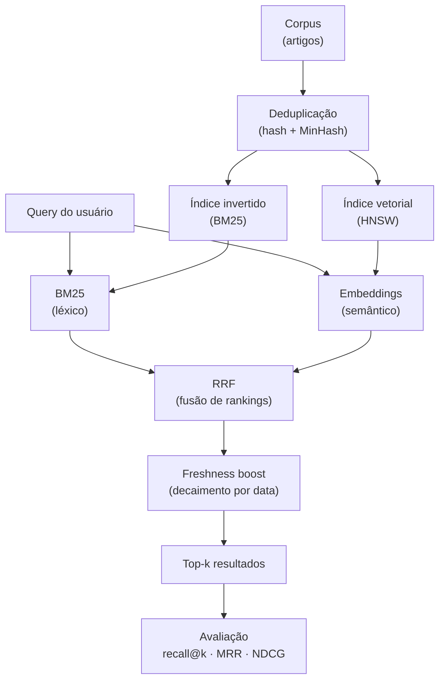

You've used OpenSearch, Elasticsearch, or FAISS. You know how to build a RAG pipeline. You can get semantic search working.

But if someone asks you "how does a real search engine work on the inside?" — you can probably say "it uses an inverted index and BM25," but not much beyond that.

This article is here to close that gap.

We'll build a mini search engine from scratch in Python, adding pieces as new problems show up. By the end, you'll understand not just *what* tools like OpenSearch do, but *why* they do it — and you'll be able to tell a teaching search system apart from real search infrastructure.

> All examples are in a **[Jupyter Notebook](https://github.com/WittmannF/wittmannf.github.io/tree/main/public/blog/information-retrieval-guide)** so you can run them cell by cell.

---

## What Is Information Retrieval?

**Information Retrieval (IR)** is the field that studies how to find relevant material within large collections of unstructured documents, given an information need.

The classic definition:

> *"Information retrieval is finding material (usually documents) of an unstructured nature (usually text) that satisfies an information need from within large collections."*
> — Manning, Raghavan & Schütze

The most important word there is **satisfies**. It's not "find documents that contain the query words." It's find documents that satisfy the user's *need* — which is a much harder problem.

---

## IR, Search, Database Query, RAG, Vector Search — What's the Difference?

These concepts live in the same neighborhood but are very different neighbors.

**Database Query**: you know the schema, you know the fields, you write `WHERE nome = 'Fernando' AND cidade = 'SP'`. The database returns exactly what you asked for. No tolerance for variation, no ranking by relevance.

**Information Retrieval / Search**: free text, no schema. The user types "how to learn machine learning" and you need to rank thousands of documents by relevance. The fundamental difference: **databases return exactness, IR returns relevance**.

**Vector Search**: documents and queries represented as dense vectors. The magic is that "cheap car" and "affordable automobile" end up close in vector space without sharing a single word. Vector search is a *technique* that can be used within IR — it's not a synonym.

**RAG (Retrieval-Augmented Generation)**: uses IR (or vector search, or both) to retrieve relevant documents, then passes those documents to an LLM to generate an answer. RAG is not a retrieval system — it's a *generation* system that depends on retrieval. RAG quality is capped by retrieval quality.

| System | Query model | Returns | Ranks by |
|---|---|---|---|
| SQL | Exact predicates | Exact matches | No |
| IR / BM25 | Bag of words | Ranked docs | Statistical relevance |
| Vector search | Vector similarity | Nearest neighbors | Distance/similarity |
| RAG | Natural language | *Generated answer* | Generation quality |

---

## The Corpus: the AI Newsletter

We'll work with this corpus throughout the article — 10 articles from a newsletter that aggregates AI content:

```python
import datetime

corpus = [
    {
        "id": 1,
        "title": "Fine-tuning GPT-4 for domain adaptation",
        "content": "We explore supervised fine-tuning of GPT-4 using domain-specific data...",
        "date": datetime.date(2024, 1, 15),
    },
    {
        "id": 2,
        "title": "LoRA: Low-Rank Adaptation of LLMs",
        "content": "LoRA reduces the number of trainable parameters by injecting trainable rank decomposition matrices...",
        "date": datetime.date(2024, 1, 20),
    },
    {
        "id": 3,
        "title": "RAG pipelines for enterprise search",
        "content": "Retrieval-Augmented Generation combines dense retrieval with language model generation...",
        "date": datetime.date(2024, 2, 1),
    },
    {
        "id": 4,
        "title": "Vector databases: FAISS vs Pinecone",
        "content": "Comparing FAISS and Pinecone for storing and querying high-dimensional embeddings...",
        "date": datetime.date(2024, 2, 10),
    },
    {
        "id": 5,
        "title": "Instruction tuning and RLHF",
        "content": "Instruction tuning aligns language models with human intent via supervised examples and RLHF...",
        "date": datetime.date(2024, 2, 15),
    },
    {
        "id": 6,
        "title": "Semantic search with sentence transformers",
        "content": "Sentence transformers produce dense vector representations ideal for semantic similarity search...",
        "date": datetime.date(2024, 3, 1),
    },
    {
        "id": 7,
        "title": "PEFT methods: LoRA, QLoRA, and adapters",
        "content": "Parameter-efficient fine-tuning (PEFT) methods like LoRA and QLoRA dramatically reduce GPU memory...",
        "date": datetime.date(2024, 3, 5),
    },
    {
        "id": 8,
        "title": "OpenSearch hybrid search tutorial",
        "content": "OpenSearch 2.x supports hybrid search combining BM25 lexical scoring with k-NN vector search...",
        "date": datetime.date(2024, 3, 10),
    },
    {
        "id": 9,
        "title": "Evaluating RAG pipelines with RAGAS",
        "content": "RAGAS provides metrics like faithfulness, answer relevancy, and context recall for RAG evaluation...",
        "date": datetime.date(2024, 3, 15),
    },
    {
        "id": 10,
        "title": "Quantization techniques for LLM inference",
        "content": "INT8 and INT4 quantization reduce model size and increase inference throughput with minimal accuracy loss...",
        "date": datetime.date(2024, 3, 20),
    },
]
```

Test query: `"fine-tuning language models"`.  
Expected relevant articles: 1, 2, 5, and 7.

---

## Problem 1: Why Doesn't `if query in text` Work?

The most naive solution:

```python
def naive_search(query: str, corpus: list) -> list:
    results = []
    for doc in corpus:
        text = (doc["title"] + " " + doc["content"]).lower()
        if query.lower() in text:
            results.append(doc)
    return results

results = naive_search("fine-tuning language models", corpus)
print([r["id"] for r in results])
# → []
```

**Zero results.** The exact phrase `"fine-tuning language models"` doesn't appear in any document.

Exact substring search breaks with any vocabulary variation, word order change, or synonym. If the doc says "PEFT methods" instead of "fine-tuning", it won't show up — even though it's exactly what you want.

---

## Problem 2: Tokenization and the Inverted Index

Let's improve by breaking the query into individual terms. But before any index, we need to prepare the text.

### Tokenization and Normalization

**Tokenization** splits text into smaller units (tokens). **Normalization** standardizes tokens to reduce irrelevant variation.

```python
import re
import string
from collections import defaultdict

def tokenize(text: str) -> list[str]:
    text = text.lower()
    text = text.translate(str.maketrans(string.punctuation, ' ' * len(string.punctuation)))
    return text.split()

print(tokenize("Fine-tuning GPT-4 for domain adaptation"))
# ['fine', 'tuning', 'gpt', '4', 'for', 'domain', 'adaptation']
```

**Stopwords** are words so common they carry no search signal: "the", "for", "and", "is". Removing them shrinks the index and reduces noise in scores.

```python
STOPWORDS = {'the', 'a', 'an', 'and', 'or', 'but', 'in', 'on', 'at',
             'to', 'for', 'is', 'are', 'was', 'were', 'of', 'with'}

def tokenize_clean(text: str) -> list[str]:
    return [t for t in tokenize(text) if t not in STOPWORDS and len(t) > 1]
```

> **Caution**: removing stopwords can break specific searches. "The Who" (the band) becomes empty strings. In general domains it helps; in specialized domains, think before you strip.

### The Inverted Index

Now the central component of any search engine.

**The problem**: you have 1 million documents and want to know which contain "fine-tuning". Scanning all docs on every query is `O(N × average_length)` — impractical at scale.

**The solution**: invert the structure. Instead of `document → list of words`, build `word → list of documents`.

Think of a phone book: the book maps `name → number`. An inverted index would be `number → name`. You trade disk space for search speed.

```
Forward index (what you have):
  doc1 → ["fine", "tuning", "gpt", "domain", ...]
  doc2 → ["lora", "low", "rank", "adaptation", ...]

Inverted index (what you want):
  "fine"      → {doc1: 2, doc7: 1}
  "tuning"    → {doc1: 1, doc5: 1, doc7: 2}
  "lora"      → {doc2: 3, doc7: 1}
  "adaptation"→ {doc1: 1, doc2: 1}
```

With the inverted index, searching for "fine-tuning" is `O(1)` — a dictionary lookup, independent of corpus size.

```python
def build_inverted_index(corpus_docs: list) -> dict[str, dict[int, int]]:
    """
    Retorna: {term: {doc_id: frequency}}
    """
    index = defaultdict(lambda: defaultdict(int))
    
    for doc in corpus_docs:
        text = doc["title"] + " " + doc["content"]
        for token in tokenize_clean(text):
            index[token][doc["id"]] += 1
    
    return {term: dict(postings) for term, postings in index.items()}

inverted_index = build_inverted_index(corpus)

print(inverted_index.get("fine", {}))
# {1: 1, 7: 1} — doc1 e doc7 contêm "fine", cada um 1 vez

print(inverted_index.get("tuning", {}))
# {1: 1, 5: 1, 7: 1}
```

---

## Problem 3: Boolean Search — AND and OR Over the Index

With the index ready, we can implement boolean search: all terms must be present (implicit AND).

The implementation is an intersection of posting lists — the document lists for each term:

```python
def boolean_search(query: str, index: dict) -> set[int]:
    terms = tokenize_clean(query)
    if not terms:
        return set()
    
    # Começa com docs do primeiro termo
    result = set(index.get(terms[0], {}).keys())
    
    # Intersecta com cada termo (AND)
    for term in terms[1:]:
        result &= set(index.get(term, {}).keys())
    
    return result

print(boolean_search("fine-tuning language models", inverted_index))
# set() — nenhum doc tem os três termos "fine", "tuning", "language", "models"

print(boolean_search("fine tuning", inverted_index))
# {1, 7} — docs que têm tanto "fine" quanto "tuning"
```

Boolean search answers "which docs match?" but not "which docs are most relevant?". With 50 results in random order, the user doesn't know where to start.

Two fundamental problems:
1. AND is too restrictive — a doc with 4 of 5 terms disappears completely
2. There's no ranking — all matches have equal weight

---

## Problem 4: What Is Relevance?

Before building ranking, we need to understand what we're ranking.

**Relevance** is the degree to which a document satisfies the user's information need. Simple to define, hard to measure.

In IR, documents usually have degrees of relevance:
- **Perfectly relevant**: directly answers the query
- **Relevant**: related, useful
- **Marginally relevant**: has some terms but doesn't answer well
- **Irrelevant**: not helpful

What a search engine does is approximate this subjective relevance using objective signals from the text. The two main signals:

**Term Frequency (TF)**: how many times does the term appear in the doc? More occurrences → likely higher relevance.

**Inverse Document Frequency (IDF)**: how rare is the term in the collection? "LoRA" appears in few docs — very discriminative. "model" appears in all of them — says little about relevance.

---

## Problem 5: TF-IDF — Weighting That Accounts for Rarity

TF-IDF combines both signals:

```
TF(t, d)  = freq(t, d) / |d|       # frequência normalizada pelo comprimento
IDF(t)    = log(N / n_t)            # N = total docs, n_t = docs que contêm t
TF-IDF    = TF(t,d) × IDF(t)
```

The IDF logic: if "model" appears in all 10 documents, `log(10/10) = 0`. No signal. If "LoRA" appears in 2 documents, `log(10/2) = 1.6`. Very informative.

```python
import math
from collections import Counter

def build_tfidf(corpus_docs: list) -> tuple[list[dict], dict]:
    N = len(corpus_docs)
    tokenized = []
    for doc in corpus_docs:
        text = doc["title"] + " " + doc["content"]
        tokenized.append(tokenize_clean(text))

    # IDF
    df = Counter()
    for tokens in tokenized:
        df.update(set(tokens))
    idf = {term: math.log(N / (df[term] + 1)) for term in df}

    # TF-IDF por doc
    tfidf_docs = []
    for tokens in tokenized:
        tf = Counter(tokens)
        total = len(tokens)
        tfidf = {term: (count / total) * idf.get(term, 0)
                 for term, count in tf.items()}
        tfidf_docs.append(tfidf)

    return tfidf_docs, idf

def tfidf_search(query: str, corpus_docs: list, tfidf_docs: list, idf: dict,
                 top_k: int = 5) -> list:
    terms = tokenize_clean(query)
    scored = []
    for i, doc in enumerate(corpus_docs):
        score = sum(tfidf_docs[i].get(term, 0) for term in terms)
        if score > 0:
            scored.append((score, doc))
    scored.sort(key=lambda x: x[0], reverse=True)
    return [doc for _, doc in scored[:top_k]]

tfidf_docs, idf = build_tfidf(corpus)
results = tfidf_search("fine-tuning language models", corpus, tfidf_docs, idf)
print([(r["id"], r["title"]) for r in results])
# → artigos 1 e 5 aparecem (têm "fine", "tuning", "language" ou "models")
```

TF-IDF is already a solid step forward. But it has two serious problems:

1. **TF grows without limit**: a doc that mentions "model" 100 times scores 10× more than one with 10 occurrences — even if it's a repetitive list with no value
2. **Ignores length**: a 10-word doc with "fine" once should be more relevant than a 10,000-word doc with "fine" once — TF-IDF treats them the same

---

## Problem 6: BM25 — the Gold Standard of Lexical Search

**BM25** (Best Match 25) fixes exactly those two problems. It emerged in the 1990s, won the TREC competition repeatedly, and remains the baseline that neural models need to beat.

The full formula:

```
BM25(d, Q) = Σ IDF(t) × [tf(t,d) × (k₁ + 1)] / [tf(t,d) + k₁ × (1 - b + b × |d|/avgdl)]
              t∈Q
```

Looks intimidating. Let's break it down piece by piece.

### BM25 IDF

```
IDF(t) = ln[(N - n_t + 0.5) / (n_t + 0.5) + 1]
```

Similar to classic IDF, but with `+0.5` to smooth and avoid division by zero.

### TF Saturation with k₁

The denominator `tf + k₁ × (...)` creates a **ceiling** on TF growth.

When `tf` gets large, the fraction `tf × (k₁ + 1) / (tf + k₁×...)` approaches `(k₁ + 1)` — a constant. The tenth occurrence of "fine-tuning" contributes much less than the first.

`k₁` controls how fast saturation happens:
- `k₁ = 0`: TF completely ignored, only IDF matters
- `k₁ = 1.2`: fast saturation (conservative)
- `k₁ = 2.0`: slower saturation

### Length Normalization with b

The factor `(1 - b + b × |d|/avgdl)` normalizes by length:

- `|d|`: tokens in the document
- `avgdl`: average length in the collection
- `b = 0`: length ignored
- `b = 1`: full normalization
- `b = 0.75`: partial normalization (default)

**Why b < 1?** Full normalization (`b = 1`) can punish long documents that genuinely cover the topic in depth. A 5,000-word article on fine-tuning with 50 occurrences may be more relevant than a 100-word snippet with 5 — even with the same normalized TF. `b = 0.75` is an empirical compromise that works well on most corpora.

```python
class BM25:
    def __init__(self, corpus_docs: list, k1: float = 1.5, b: float = 0.75):
        self.k1 = k1
        self.b = b
        self.corpus_docs = corpus_docs
        
        self.tokenized = []
        for doc in corpus_docs:
            text = doc["title"] + " " + doc["content"]
            self.tokenized.append(tokenize_clean(text))

        N = len(self.tokenized)
        self.avgdl = sum(len(t) for t in self.tokenized) / N

        df = Counter()
        for tokens in self.tokenized:
            df.update(set(tokens))
        self.idf = {
            term: math.log((N - df[term] + 0.5) / (df[term] + 0.5) + 1)
            for term in df
        }

    def score(self, query: str, doc_idx: int) -> float:
        terms = tokenize_clean(query)
        tf_map = Counter(self.tokenized[doc_idx])
        dl = len(self.tokenized[doc_idx])
        
        total = 0.0
        for term in terms:
            tf = tf_map.get(term, 0)
            idf = self.idf.get(term, 0.0)
            numerator = tf * (self.k1 + 1)
            denominator = tf + self.k1 * (1 - self.b + self.b * dl / self.avgdl)
            total += idf * (numerator / denominator) if denominator else 0
        return total

    def search(self, query: str, top_k: int = 5) -> list:
        scored = [
            (self.score(query, i), doc)
            for i, doc in enumerate(self.corpus_docs)
        ]
        scored.sort(key=lambda x: x[0], reverse=True)
        return [doc for score, doc in scored if score > 0][:top_k]

bm25 = BM25(corpus)
results = bm25.search("fine-tuning language models")
print([(r["id"], r["title"]) for r in results])
```

### BM25 vs TF-IDF: Head-to-Head

| Aspect | TF-IDF | BM25 |
|---|---|---|
| TF growth | Linear, unbounded | Saturated (ceiling at k₁+1) |
| Doc length | Ignored | Explicitly normalized |
| Parameters | None | k₁ and b (tunable) |
| Practical performance | Reasonable baseline | Superior on most benchmarks |

BM25 still dominates because two simple tweaks fix TF-IDF's biggest problems, and it generalizes surprisingly well. Modern neural models often beat BM25 by only small margins.

**BM25's remaining limitation**: it's still purely lexical. "PEFT" and "fine-tuning" share no words — BM25 can't connect them. For that, we need semantics.

---

## Problem 7: Embeddings — Search That Understands Meaning

Embeddings turn text into dense vectors where semantically similar texts end up close together. "fine-tuning" and "PEFT" sit near each other; "fine-tuning" and "quantization" sit far apart — regardless of the words used.

```python
from sentence_transformers import SentenceTransformer
import numpy as np

model = SentenceTransformer("all-MiniLM-L6-v2")

def build_vector_index(corpus_docs: list, model) -> np.ndarray:
    texts = [doc["title"] + " " + doc["content"] for doc in corpus_docs]
    # normalize_embeddings=True → podemos usar produto interno como similaridade de cosseno
    return model.encode(texts, normalize_embeddings=True)

def vector_search(query: str, corpus_docs: list, index: np.ndarray,
                  model, top_k: int = 5) -> list:
    query_vec = model.encode([query], normalize_embeddings=True)[0]
    scores = index @ query_vec  # produto interno = coseno (vetores normalizados)
    ranked_idx = np.argsort(scores)[::-1][:top_k]
    return [corpus_docs[i] for i in ranked_idx]

vec_index = build_vector_index(corpus, model)
results = vector_search("fine-tuning language models", corpus, vec_index, model)
print([(r["id"], r["title"]) for r in results])
# → artigos 1, 2, 5, 7 aparecem — inclui LoRA e PEFT!
```

LoRA (doc2) and PEFT (doc7) now show up even without sharing words with the query.

### When Embeddings Help vs. When They Hurt

**Embeddings help when:**
- Paraphrases and synonyms: "cheap car" → docs about "affordable automobile"
- Multilingual: query in Portuguese, docs in English
- Concepts with no lexical overlap: "how to lose weight" → docs about "diet and exercise"

**Embeddings hurt when:**

**1. Exact matching with rare terms**
Query: `CVE-2024-3094` (a specific security vulnerability). The model will try to find semantic neighbors of something that probably doesn't exist in the model's embedding space. You want that exact string.

**2. Domain-specific jargon**
Models trained on general text don't know your internal product, team acronyms, or specialized terminology. "XPTO-Analytics-v2" will have an almost random embedding.

**3. Precision questions**
"What is the exact interest rate for product Y?" — you want the specific number, not documents semantically related to finance.

```
BM25 strong → Embeddings weak: exact strings, codes, rare jargon
Embeddings strong → BM25 weak: paraphrases, synonyms, cross-lingual
```

---

## Problem 8: Hybrid Search with RRF

The key observation is that BM25 and embeddings fail in complementary cases. When one fails, the other often succeeds.

**Hybrid search** combines both. The challenge: scores live on different scales. BM25 returns values between 0 and ~5. Cosine similarity returns between 0 and 1. You can't simply add them.

**RRF (Reciprocal Rank Fusion)** solves this elegantly: instead of combining scores, it combines *rankings*. Documents that rank well in both lists gain more.

```
RRF_score(d) = Σᵢ 1 / (k + rankᵢ(d))
```

`k = 60` is a smoothing constant — it keeps position 1 from dominating everything.

```python
def reciprocal_rank_fusion(rankings: list[list[int]], k: int = 60) -> list[int]:
    """
    rankings: lista de listas de doc_ids, cada uma ordenada por relevância
    """
    scores = {}
    for ranking in rankings:
        for rank, doc_id in enumerate(ranking):
            scores[doc_id] = scores.get(doc_id, 0) + 1 / (k + rank + 1)
    return sorted(scores.keys(), key=lambda x: scores[x], reverse=True)

def hybrid_search(query: str, corpus_docs: list, bm25: BM25,
                  vec_index: np.ndarray, model, top_k: int = 5) -> list:
    # Rankings individuais
    bm25_results = bm25.search(query, top_k=len(corpus_docs))
    vec_results = vector_search(query, corpus_docs, vec_index, model,
                                top_k=len(corpus_docs))
    
    bm25_ids = [doc["id"] for doc in bm25_results]
    vec_ids = [doc["id"] for doc in vec_results]
    
    # Fusão por RRF
    fused_ids = reciprocal_rank_fusion([bm25_ids, vec_ids])[:top_k]
    
    id_to_doc = {doc["id"]: doc for doc in corpus_docs}
    return [id_to_doc[doc_id] for doc_id in fused_ids if doc_id in id_to_doc]

results = hybrid_search("fine-tuning language models", corpus, bm25, vec_index, model)
print([(r["id"], r["title"]) for r in results])
# → 1, 2, 5, 7 nos primeiros lugares ✓
```

**Why does RRF work so well?** Because it doesn't depend on calibrating absolute scores — only relative position matters. It's plug-and-play, with no training data required. Elasticsearch studies show RRF improves NDCG by ~18% compared to BM25 alone.

---

## Problem 9: Deduplication

Your newsletter aggregates from multiple sources. The same article can arrive via different URLs or with slight title variations. Duplicates inflate the index and pollute results.

### Exact Deduplication (Hash)

```python
import hashlib

def hash_doc(doc: dict) -> str:
    text = doc["title"] + " " + doc["content"]
    return hashlib.sha256(text.encode()).hexdigest()[:16]

def deduplicate_exact(corpus_docs: list) -> list:
    seen_hashes = set()
    unique = []
    for doc in corpus_docs:
        h = hash_doc(doc)
        if h not in seen_hashes:
            seen_hashes.add(h)
            unique.append(doc)
    return unique
```

Exact hashing won't catch "almost identical" documents (same content with minor formatting or metadata differences).

### Approximate Deduplication (MinHash)

MinHash efficiently estimates **Jaccard similarity** between n-gram sets:

```python
import random

def get_shingles(text: str, k: int = 3) -> set[str]:
    words = tokenize_clean(text)
    return {' '.join(words[i:i+k]) for i in range(len(words) - k + 1)}

def minhash_signature(shingles: set[str], n_hash: int = 64) -> list[int]:
    if not shingles:
        return [0] * n_hash
    random.seed(42)
    hash_params = [(random.randint(1, 2**31), random.randint(0, 2**31))
                   for _ in range(n_hash)]
    return [min((a * hash(s) + b) % (2**31) for s in shingles)
            for a, b in hash_params]

def jaccard_estimate(sig1: list[int], sig2: list[int]) -> float:
    return sum(a == b for a, b in zip(sig1, sig2)) / len(sig1)

def deduplicate_approx(corpus_docs: list, threshold: float = 0.85) -> list:
    sigs = []
    for doc in corpus_docs:
        text = doc["title"] + " " + doc["content"]
        sigs.append(minhash_signature(get_shingles(text)))
    
    to_keep = []
    for i, doc in enumerate(corpus_docs):
        is_dup = any(
            jaccard_estimate(sigs[i], sigs[j]) > threshold
            for j in range(len(to_keep))
        )
        if not is_dup:
            to_keep.append(doc)
    return to_keep
```

---

## Problem 10: Freshness — Recent Articles Deserve a Boost

For a newsletter, yesterday's article is more valuable than one from two years ago, even with similar relevance. You can combine the relevance score with temporal decay:

```python
def freshness_boost(doc: dict, decay_days: int = 30) -> float:
    age = (datetime.date.today() - doc["date"]).days
    # Decaimento exponencial: 1.0 hoje → ~0.37 em decay_days
    return math.exp(-age / decay_days)

def hybrid_search_with_freshness(
    query: str, corpus_docs: list, bm25: BM25,
    vec_index: np.ndarray, model,
    freshness_weight: float = 0.2,
    top_k: int = 5
) -> list:
    base = hybrid_search(query, corpus_docs, bm25, vec_index, model,
                         top_k=len(corpus_docs))
    id_to_doc = {doc["id"]: doc for doc in corpus_docs}
    
    scored = []
    for rank, doc in enumerate(base):
        relevance = 1 / (1 + rank)
        fresh = freshness_boost(doc)
        final = (1 - freshness_weight) * relevance + freshness_weight * fresh
        scored.append((final, doc))
    
    scored.sort(key=lambda x: x[0], reverse=True)
    return [doc for _, doc in scored[:top_k]]
```

`freshness_weight = 0.2` means 80% of the final score comes from relevance and 20% from recency. Tune it for your use case.

---

## Problem 11: Evaluation — How Do I Know If I Improved?

Looking at results manually doesn't scale. You need metrics to compare system versions objectively.

The process: build a test set with queries and relevance judgments → run the engine → compute metrics.

### Recall@k and Precision@k

```
Recall@k    = |relevant ∩ top-k| / |relevant|       # "did I miss anything?"
Precision@k = |relevant ∩ top-k| / k                  # "is what I returned good?"
```

### MRR (Mean Reciprocal Rank)

Focused on the *first* relevant answer. Useful for Q&A and FAQ:

```
MRR = average(1 / position_of_first_relevant)
```

First relevant at position 1: `MRR = 1.0`. At position 3: `MRR = 0.33`.

### NDCG (Normalized Discounted Cumulative Gain)

The most complete metric. Works with **graded** relevance (0–3) and discounts results in lower positions:

```
DCG@K  = Σᵢ rel_i / log₂(i + 1)
NDCG@K = DCG@K / IDCG@K    (IDCG = ideal DCG = perfect ranking)
```

`NDCG@10 = 1.0` means a perfect ranking. Position 1 counts more than position 2, which counts more than position 3, and so on.

```python
def recall_at_k(retrieved_ids: list, relevant_ids: set, k: int) -> float:
    return len(set(retrieved_ids[:k]) & relevant_ids) / len(relevant_ids)

def reciprocal_rank(retrieved_ids: list, relevant_ids: set) -> float:
    for rank, doc_id in enumerate(retrieved_ids, start=1):
        if doc_id in relevant_ids:
            return 1.0 / rank
    return 0.0

def dcg(relevances: list[int], k: int = None) -> float:
    rels = relevances[:k] if k else relevances
    return sum(r / math.log2(i + 2) for i, r in enumerate(rels))

def ndcg(relevances: list[int], k: int = None) -> float:
    ideal = sorted(relevances, reverse=True)
    idcg = dcg(ideal, k)
    return dcg(relevances, k) / idcg if idcg > 0 else 0.0

def evaluate(search_fn, queries_with_relevance: list, k: int = 5) -> dict:
    recalls, rrs = [], []
    for query, relevant_ids in queries_with_relevance:
        results = search_fn(query)
        retrieved = [doc["id"] for doc in results]
        recalls.append(recall_at_k(retrieved, set(relevant_ids), k))
        rrs.append(reciprocal_rank(retrieved, set(relevant_ids)))
    return {
        f"recall@{k}": sum(recalls) / len(recalls),
        "mrr": sum(rrs) / len(rrs),
    }

# Test set
queries_eval = [
    ("fine-tuning language models", [1, 2, 5, 7]),
    ("vector databases embeddings",  [4, 6]),
    ("RAG pipeline evaluation",       [3, 9]),
]

bm25_metrics   = evaluate(lambda q: bm25.search(q), queries_eval)
hybrid_metrics = evaluate(
    lambda q: hybrid_search(q, corpus, bm25, vec_index, model), queries_eval
)

print(f"BM25    → recall@5: {bm25_metrics['recall@5']:.2f}, MRR: {bm25_metrics['mrr']:.2f}")
print(f"Híbrido → recall@5: {hybrid_metrics['recall@5']:.2f}, MRR: {hybrid_metrics['mrr']:.2f}")
```

Metrics make comparisons objective. If you swapped the embedding model or adjusted the freshness weight — now you know whether things got better or worse.

---

## What Changes in Production?

The mini search engine we built works well for hundreds or a few thousand documents. A real search system faces very different challenges.

### Scale and Sharding

With millions of documents, the index won't fit in memory. Elasticsearch and OpenSearch use **sharding**: the index is split into multiple shards, each shard a complete Lucene index. A query hits all shards in parallel, and results are merged.

```
ES Index
 └── Shard 1 (primary + N replicas)
      └── Lucene Index
           └── Segment 1, Segment 2, ... Segment N
```

### Lucene Segments — Efficient Incremental Indexing

Lucene doesn't modify the index in place. New documents go into an in-memory buffer, which is periodically flushed as a new **segment** (immutable mini-index). A background thread merges small segments into larger ones.

This makes incremental indexing natural: you don't need to rebuild everything to add new documents.

Elasticsearch by default opens segments from the memory buffer every 1 second (`refresh_interval`), making documents searchable in ~1s without a full disk commit (near-real-time search).

During bulk loads, disabling refresh can increase throughput **10×**: `PUT /index/_settings {"index": {"refresh_interval": "-1"}}`.

### Text Analysis in Production

Our tokenizer is simple. Real systems have full pipelines:
- **Stemming/Lemmatization**: "correndo" → "correr", "running" → "run"
- **Synonyms**: "automóvel" expands to ["carro", "veículo"]
- **Unicode normalization**: "café" → "cafe"
- The same pipeline must run on documents **and** queries

### Vector Search at Scale: HNSW

Our `vector_search` does exact search by multiplying the query against all embeddings. For 1 million docs with 768-dim vectors, that's ~6GB of multiplications per query.

**HNSW (Hierarchical Navigable Small World)** solves this with approximate search:
- Graph in hierarchical layers: upper layers have long connections (fast navigation), the base layer has short connections (precision)
- Query navigates down the graph: `O(log N)` instead of `O(N)`
- Trade-off: **ANN** (Approximate Nearest Neighbor) — doesn't guarantee the exact K neighbors, but the K most likely ones with ~95%+ recall

Key HNSW parameters:
- `M`: connections per node (more = better recall, more memory)
- `efConstruction`: build quality (more = better index, slower to build)
- `efSearch`: search rigor (more = better recall, slower)

### Real Tools

| Tool | Specialty | When to use |
|---|---|---|
| **Elasticsearch/OpenSearch** | BM25 + HNSW + hybrid search | Most enterprise cases |
| **Lucene** | Engine under ES/OS | Full control in Java |
| **FAISS** | Pure ANN (vectors) | Vector search only |
| **Vespa** | Native hybrid, ML in the index | Complex ranking, ML-heavy |
| **Typesense** | Typo tolerance, faceting | Catalogs, e-commerce |
| **Meilisearch** | Developer experience | Smaller projects, simple APIs |

What you built here is the conceptual core of what all these tools implement — with much more performance optimization, sharding, and additional features on top.

---

## The Complete System



| Stage | What it solves |
|---|---|
| Tokenization + normalization | Capitalization and punctuation variation |
| Inverted index | O(1) lookup instead of O(N) |
| Boolean search | Basic matching with AND/OR |
| TF-IDF | Relevance with rarity weighting |
| BM25 | TF saturation + length normalization |
| Embeddings | Semantics and synonyms |
| RRF | Fusing scores on different scales |
| Deduplication | Duplicate articles in the corpus |
| Freshness | Temporal relevance |
| Recall@k / MRR / NDCG | Objective comparison between versions |
| OpenSearch | All of this in production, at scale |

---

## OpenSearch: The Same Thing in Production

```python
from opensearchpy import OpenSearch

client = OpenSearch(hosts=[{"host": "localhost", "port": 9200}])

# Cria índice com campo de texto (BM25) + campo vetorial (HNSW)
index_body = {
    "settings": {"index": {"knn": True}},
    "mappings": {
        "properties": {
            "title":     {"type": "text"},
            "content":   {"type": "text"},
            "date":      {"type": "date"},
            "embedding": {
                "type": "knn_vector",
                "dimension": 384,
                "method": {"name": "hnsw", "engine": "faiss"},
            },
        }
    },
}
client.indices.create(index="newsletter", body=index_body, ignore=400)

# Busca híbrida (OpenSearch 2.x)
def opensearch_hybrid_search(query: str, query_emb: list, top_k: int = 5):
    return client.search(
        index="newsletter",
        body={
            "query": {
                "hybrid": {
                    "queries": [
                        {"multi_match": {"query": query, "fields": ["title^2", "content"]}},
                        {"knn": {"embedding": {"vector": query_emb, "k": top_k}}},
                    ]
                }
            },
            "size": top_k,
        },
    )
```

OpenSearch uses BM25 natively for `text` fields, HNSW for vector search, and the `hybrid` query type handles fusion — the equivalent of our manual RRF.

---

## How to Talk About This in an Interview

If you're interviewing for Search Engineer, Relevance Engineer, or ML Engineer roles on search products, this narrative arc works:

**Typical question**: *"How would you design a search system for an AI newsletter?"*

**Answer structure:**

1. **Start with the problem**: "We need to connect queries with varied vocabulary to articles that use different terminology but similar meaning."

2. **Show the progression**: "The foundation is BM25 — what OpenSearch uses natively. It handles 70–80% of cases with good normalization. Where it fails is semantics: 'fine-tuning' and 'PEFT' have no lexical overlap."

3. **Propose the mature solution**: "BM25 + embeddings with RRF is the production standard. In OpenSearch 2.x you configure it with `hybrid` queries and `normalization_processor`."

4. **Mention evaluation**: "We measure recall@k, MRR, and NDCG to make sure changes to the embedding model or BM25 parameters actually improve things before going to production."

5. **Bonus — when embeddings hurt**: "For searches by IDs, product codes, or highly specific jargon, BM25 wins because general-purpose embeddings have no representation for those terms."

This arc — from simple to hybrid, with trade-offs and metrics — shows you understand the fundamentals, not just the recipe.

---

## Resources to Go Deeper

- **Introduction to Information Retrieval** (Manning, Raghavan & Schütze) — the classic book, available online for free
- [`rank_bm25`](https://github.com/dorianbrown/rank_bm25) — BM25 and variants (BM25+, BM25L) in Python
- [`sentence-transformers`](https://www.sbert.net/) — embedding models for semantic search
- **BEIR benchmark** — benchmark suite for evaluating IR systems
- [OpenSearch docs: hybrid search](https://opensearch.org/docs/latest/search-plugins/hybrid-search/)

---

*Jupyter notebook with all runnable examples available [in the repository](https://github.com/WittmannF/wittmannf.github.io/tree/main/public/blog/information-retrieval-guide).*
